# Power BI Premium capaciteit implementeren en beheren

**Samen vatting:** Power BI Premium biedt consistente prestaties, ondersteuning voor grote gegevens volumes en de flexibiliteit van een Unified self-service-en Enter prise BI-platform voor iedereen in uw organisatie. Dit niveau 300 technisch White Paper is speciaal geschreven voor Power BI beheerders en auteurs van inhoud en uitgevers. Het is erop gericht om ze inzicht te geven in de mogelijkheden van Power BI Premium en om uit te leggen hoe schaal bare oplossingen moeten worden ontworpen, geïmplementeerd, gecontroleerd en opgelost.

**Auteur:** [Peter Myers](https://www.linkedin.com/in/peterjsmyers) (Data platform MVP en onafhankelijke bi-expert met bitsgewijze oplossingen)

**Technische revisoren:** Adam Saxton, Akshai Mirchandani, Bhavik handelaar, David Magar, Josh Caplan, Michael Blythe, Nimrod Shalit, Olivier Matrat, Swati Gupta

**Van toepassing op:** Capaciteit van Power BI-service, Power BI Premium en Azure Power BI Embedded

> [!NOTE]
> U kunt dit technische document opslaan of afdrukken door in uw browser **Afdrukken** en vervolgens **Opslaan als PDF-bestand** te selecteren.

## Inleiding tot Power BI

Power BI is een Business Analytics-service die is ontworpen om inzichten te leveren die snelle, weloverwogen beslissingen kunnen nemen. Sinds de release in 2015 is deze snel een populaire service die wordt gebruikt voor het leveren van oplossingen voor de kleinste organisaties tot het grootste aantal ondernemingen.

Het wordt op twee manieren beschikbaar gesteld: als een Cloud service en als een on-premises rapportage oplossing met de naam **Power bi Report Server**. \[[1](#endnote-01)\]

Power BI als een Cloud service is software-as-a-Service (SaaS) \[[2](#endnote-02)\]. Dit vertegenwoordigt een set services en toepassingen waarmee organisaties oplossingen kunnen ontwikkelen, implementeren, beheren en delen om hun bedrijf te bewaken.

Het is niet de bedoeling van dit technisch document om een uitgebreide beschrijving van de Power BI-service te geven. In plaats daarvan is het gericht op onderwerpen die relevant zijn voor het onderwerp van Power BI Premium. Raadpleeg de uitgebreide [Power bi-documentatie](service-admin-premium-multi-geo.md)voor algemene informatie over Power bi. Raadpleeg voor een gedetailleerde beschrijving van de Power BI-service met de nadruk op het uitvoeren van goede bedrijfs implementaties, de uitgebreide planning van [een Power bi Enter prise Deployment](https://aka.ms/pbienterprisedeploy) -technisch document.

In de context van dit technisch onderwerp worden in deze sectie de capaciteiten en de beschik bare capaciteit, Power BI inhouds typen, model opslag modi en licenties beschreven. Een goed idee van deze onderwerpen is essentieel voor het implementeren en beheren van Power BI Premium.

### Capaciteiten

**Capaciteiten** zijn een kern Power bi concept voor een set resources (opslag, processor en geheugen) die worden gebruikt voor het hosten en leveren van Power bi inhoud. Capaciteiten worden gedeeld of zijn toegewezen. Een **Gedeelde capaciteit** wordt gedeeld met andere Microsoft-klanten, terwijl een **Toegewezen capaciteit** volledig voor één klant is bestemd. Toegewezen capaciteiten worden geïntroduceerd in het onderwerp [Premium-capaciteiten](#premium-capacities) .

Met gedeelde capaciteit worden workloads uitgevoerd via rekenresources die met andere klanten worden gedeeld. Omdat de capaciteit resources moet delen, worden er beperkingen opgelegd om te zorgen voor een ' billijk Play ', zoals de maximale model grootte (1 GB) en de maximale dagelijkse vernieuwings frequentie (acht keer per dag).

### Werkruimten

Power BI-werk ruimten bevinden zich in capaciteiten en vertegenwoordigen de containers beveiliging, samen werking en implementatie. Elke Power BI-gebruiker heeft een persoonlijke werkruimte die **Mijn werkruimte** heet. U kunt aanvullende werk ruimten maken om samen werking en implementatie in te scha kelen. dit worden ook wel **werk ruimten**genoemd. Standaard worden werk ruimten, met inbegrip van persoonlijke werk ruimten, gemaakt in de gedeelde capaciteit.

### Inhouds typen Power BI

Als u Power BI Premium onderwerpen wilt introduceren, is het belang rijk om te beginnen met een grondige bespreking van Power BI architectuur, waaronder fundamentele inhouds typen.

Alle Power BI inhoud wordt opgeslagen en beheerd in werk ruimten die containers voor Power BI inhoud zijn. Elke Power BI gebruiker heeft zijn eigen persoonlijke werk ruimte, maar de algemene best practice is om werk ruimten te maken. Met werk ruimten kunt u inhoud gezamenlijk en samen werken aan inhoud. Ze bieden ook de mogelijkheid om inhoud te faseren en distribueren naar brede doel groepen als apps.

De volgende Power BI inhoud wordt opgeslagen in werk ruimten:

- Gegevensstromen
- Gegevenssets
- Werkmappen
- Rapporten
- Dashboards

#### Gegevensstromen

Power BI gegevens stromen helpen organisaties gegevens uit verschillende bronnen samen te voegen. Ze kunnen worden beschouwd als gegevens die zijn voor bereid en klaargezet voor gebruik in modellen, maar ze kunnen niet rechtstreeks als bron worden gebruikt voor rapportage. Ze maken gebruik van de uitgebreide verzameling micro soft data connectors, waarmee gegevens kunnen worden opgenomen vanuit on-premises en Cloud gegevens bronnen.

Gegevens stromen kan alleen worden gemaakt en beheerd in werk ruimten en ze worden opgeslagen als entiteiten in het common data model (CDM) in Azure Data Lake Storage Gen2. Normaal gesp roken worden ze periodiek vernieuwd om actuele gegevens op te slaan.

Raadpleeg het document [self-service data prep in Power bi (preview)](service-dataflows-overview.md) voor meer informatie.

#### Gegevenssets

Power BI data sets vertegenwoordigen een bron van gegevens die gereed zijn voor rapportage en visualisatie. Er zijn veel soorten gegevens sets, gemaakt door:

- Verbinding maken met een bestaand gegevens model dat niet wordt gehost in een Power BI capaciteit
- Een Power BI Desktop-bestand uploaden dat een model bevat
- Het uploaden van een Excel-werkmap (met een of meer Excel-tabellen en/of een gegevens model van een werkmap) of het uploaden van een bestand met door Komma's gescheiden waarden (CSV)
- De Power BI-service gebruiken om een push-, streaming-of Hybrid stream-gegevensset te maken

Behalve voor het streamen van gegevens sets \[[3](#endnote-03)\], vertegenwoordigt de gegevensset een gegevens model dat gebruikmaakt van de rijpe model technologieën van Analysis Services.

Houd er rekening mee dat in documentatie soms de gegevens sets en modellen van de terminologie kunnen worden gewijzigd. In het algemeen wordt vanuit een Power BI-service perspectief een **DataSet** genoemd, en vanuit een ontwikkelings oogpunt wordt het een **model**genoemd. In de context van dit White Paper hebben ze veel hetzelfde.

##### Extern gehoste modellen

Als u verbinding wilt maken met een extern gehoste model, moet u de [on-premises gegevens gateway](service-gateway-onprem.md) installeren om verbinding te maken met SQL Server Analysis Services, ongeacht of deze on-premises of VM-hosted Infrastructure-as-a-Service (IaaS) is. Azure Analysis Services vereist geen gateway. Dit scenario is vaak zinvol wanneer bestaande model investeringen bestaan, normaal gesp roken deel uitmaken van het Enter prise Data Warehouse (EDW). Hiermee kan Power BI een live- **verbinding** (LC) uitvoeren naar Analysis Services en dit doen door gegevens machtigingen af te dwingen met de identiteit van de Power bi rapport gebruiker. Voor SQL Server Analysis Services worden zowel multidimensionale modellen (kubussen) als tabellaire modellen ondersteund. Zoals in de volgende afbeelding wordt weer gegeven, geeft een gegevensset van een live-verbinding query's door aan extern gehoste modellen.

##### Power BI Desktop ontwikkelde modellen

Power BI Desktop-een client toepassing die bestemd is voor Power BI ontwikkeling-kan worden gebruikt om een model te ontwikkelen dat in feite een Analysis Services tabellair model is. Modellen kunnen worden ontwikkeld door gegevens te importeren uit gegevens stromen, die vervolgens kunnen worden geïntegreerd met andere gegevens bronnen. Hoewel de specifieke informatie over de manier waarop het model leren kan worden bereikt, buiten het bereik van dit technisch document valt, is het belang rijk te weten dat er drie verschillende soorten modellen zijn die kunnen worden ontwikkeld met behulp van Power BI Desktop. Deze modi bepalen of gegevens in het model worden geïmporteerd of dat ze in de gegevens bron blijven staan. De drie modi zijn: importeren, DirectQuery en samengesteld. In het onderwerp [opslag modi voor modellen](#model-storage-modes) wordt een volledige bespreking van elke modus besproken.

Extern gehoste modellen en modellen die in Power BI bureau blad zijn ontwikkeld, kunnen beveiliging op RIJNIVEAU afdwingen voor het beperken van de gegevens die kunnen worden opgehaald voor een bepaalde gebruiker. Gebruikers die zijn toegewezen aan de beveiligings groep verkopers kunnen bijvoorbeeld alleen rapport gegevens weer geven voor de verkoop regio's waaraan ze zijn toegewezen. Rollen van beveiliging op rijniveau kunnen dynamisch of statisch zijn. **Dynamische rollen** filteren op de rapport gebruiker, terwijl **statische rollen** dezelfde filters toep assen voor alle gebruikers die zijn toegewezen aan de rol.

##### Excel-werkmap modellen

Het maken van gegevens sets op basis van Excel-werkmappen of CSV-bestanden leidt ertoe dat er automatisch een model wordt gemaakt. Excel-tabellen en CSV-gegevens worden geïmporteerd om model tabellen te maken, terwijl een Excel-werkmap gegevens model wordt omgezet om een Power BI model te maken. In alle gevallen worden bestands gegevens in een model geïmporteerd.

Er kan onderscheid worden gemaakt tussen Power BI gegevens sets die modellen vertegenwoordigen:

- Ze worden gehost in de Power BI-service of worden extern gehost door Analysis Services
- Ze kunnen geïmporteerde gegevens opslaan, of ze kunnen Passthrough-query aanvragen verzenden naar onderliggende gegevens bronnen of een combi natie van beide

Hier volgt een overzicht van belang rijke feiten over Power BI gegevens sets die modellen vertegenwoordigen:

- Voor SQL Server Analysis Services gehoste modellen is een gateway vereist voor het uitvoeren van KREDIETBRIEF query's
- Power BI-gehoste modellen waarmee gegevens worden geïmporteerd
  - Moet volledig in het geheugen worden geladen, zodat er een query kan worden uitgevoerd
  - Vernieuwen vereisen om gegevens actueel te houden en moet gateways omvatten wanneer bron gegevens niet rechtstreeks via internet toegankelijk zijn
- Power BI-gehoste modellen die gebruikmaken van DirectQuery-opslag modus (DQ), moeten verbinding hebben met de bron gegevens. Wanneer het model wordt opgevraagd, worden met Power BI query's naar de bron gegevens uitgevoerd om de huidige gegevens op te halen. In deze modus moeten gateways worden betrokken als bron gegevens niet rechtstreeks via internet toegankelijk zijn.
- Modellen kunnen regels voor beveiliging op rijniveau afdwingen, filters afdwingen om de toegang tot gegevens voor bepaalde gebruikers te beperken

Om Power BI Premium te implementeren en te beheren, is het belang rijk om te begrijpen waar modellen worden gehost, de opslag modus, afhankelijkheden van gateways, de grootte van geïmporteerde gegevens en het type en de frequentie van het vernieuwen. Deze kunnen veel invloed hebben op de Power BI Premium resources. Daarnaast kan het model ontwerp zelf, met inbegrip van de gegevens voorbereidings query's en berekeningen, toevoegen aan de combi natie van overwegingen.

Het is ook belang rijk om te begrijpen dat Power BI gehoste import modellen kunnen vernieuwen volgens planning of op aanvraag worden geactiveerd door een gebruiker in de Power BI-service.

Het ontwerpen van geoptimaliseerde modellen wordt verderop in dit technisch document besproken in het onderwerp [optimalisatie modellen](#optimizing-models) .

#### Werkmappen

Power BI werkmappen zijn een Power BI inhouds type \[[vier](#endnote-04)\]. Dit zijn Excel-werkmappen die zijn geüpload naar de Power BI-service en die niet moeten worden verward met geüploade Excel-werkmappen die gegevens sets maken (modellen). Het inhouds type van de werkmap vertegenwoordigt een verbinding met een werkmap, die naar de Power BI-service kan worden geüpload of in de Cloud opslag in OneDrive of share point online blijft.

Het is belang rijk om te begrijpen dat dit inhouds type niet beschikbaar is als gegevens bron voor Power BI gegevens visualisaties. In plaats daarvan kunt u het openen als een werkmap in de Power BI-service met behulp van Excel online. Het belangrijkste voor nemen van dit inhouds type is het toestaan van verouderde Excel-werkmap rapporten vanuit de Power BI-service, en om het mogelijk te maken dat de gegevens visualisaties worden vastgemaakt aan Power BI Dash boards.

Raadpleeg het document [gegevens ophalen uit Excel-werkmap bestanden](service-excel-workbook-files.md) voor meer informatie.

#### Rapporten

Er zijn twee soorten rapporten: Power BI rapporten en gepagineerde rapporten.

**Power bi rapporten** bieden een interactieve ervaring voor gegevens visualisatie die met slechts één gegevensset kan worden verbonden. Rapporten zijn vaak ontworpen om de deelname van gebruikers te stimuleren, zodat ze kunnen communiceren met een buitengewone matrix van mogelijkheden, zoals filteren, segmenteren, kruislings filteren en markeren, inzoomen, inzoomen, inzoomen, & taal vragen, focussen, pagina navigatie, Spotlight, blad wijzers weer geven en meer.

In de context van dit technisch document is het belang rijk om te begrijpen hoe de Power BI architectuur, Power BI rapport ontwerp en gebruikers interacties alle gevolgen kunnen hebben voor de Power BI-service bronnen:

- Als u rapporten wilt laden en ermee wilt werken op basis van import modellen, moet het model volledig in het geheugen worden geladen (ongeacht of het Power BI-service of extern wordt gehost)
- Elk rapport Visual geeft een query om gegevens op te halen door het model te doorzoeken
- Over het algemeen moeten de interacties voor filteren en Slicers query's uitvoeren op het model. Als u bijvoorbeeld de selectie van een slicer wijzigt, moeten alle visuals op de pagina opnieuw worden geladen \[[5](#endnote-05)\]
- Power BI-rapporten niet garanderen dat huidige gegevens worden weer gegeven. mogelijk moet de gebruiker het rapport vernieuwen om de rapport pagina en de visuals opnieuw te laden
- Gebruikers kunnen samen werken met de Q & een functie in natuurlijke taal om vragen te stellen, waardoor het ontwerp van Power BI-rapport wordt toegestaan en de gegevensset vertegenwoordigt een door de Power BI gehoste gegevens import model of een KREDIETBRIEF gegevensset die is geconfigureerd om Q & A in te scha kelen.

**Gepagineerde rapporten** voor het publiceren en weer geven van rapporten van SQL Server Reporting Services (SSRS) (\*. RDL). Zoals bij hun naam wordt voorgesteld, worden gepagineerde rapporten doorgaans gebruikt wanneer de vereisten het afdrukken naar een vaste pagina grootte vereisen, of wanneer er variabelen lijsten zijn met gegevens die volledig moeten worden uitgevouwen. Bijvoorbeeld een factuur die is ontworpen voor rendering op meerdere pagina's (in plaats van te schuiven binnen een visueel element) en om af te drukken.

De twee ondersteunde rapport typen bieden keuze voor ontwerpers van rapporten, zodat ze het type kunnen selecteren op basis van vereisten en beoogd gebruik. Over het algemeen zijn Power BI rapporten ideaal voor interactieve ervaringen, waardoor de gebruiker inzichten van gegevens kan verkennen en ontdekken, terwijl gepagineerde rapporten beter geschikt zijn voor op para meters gebaseerde pagina-indelingen.

Ongeacht het rapport type is het van cruciaal belang om de belasting van het rapport en gegevens updates te bereiken (wanneer filters of para meters worden gewijzigd) om een betrouw bare en goed presterende gebruikers ervaring te bieden.

#### Dashboards

Power BI Dash boards zijn bedoeld voor het leveren van bewakings ervaringen en zijn conceptueel gezien zeer verschillend van Power BI rapporten. Dash boards zijn ontworpen voor weer gave op een enkel glas venster om waarden en gegevens visualisaties in tegels op te geven. Over het algemeen bieden Dash boards minder interactie ervaring dan Power BI rapporten, waarbij sommige dashboard ontwerpen geen interactie verwachten. Bijvoorbeeld een dash board zonder toezicht dat is gepresenteerd op een niet-aanraak scherm in een server ruimte. Een ander aanzienlijk verschil is dat Dash boards de tegels van de bron gegevens uit meerdere gegevens sets kunnen weer geven, terwijl een Power BI rapport nooit op één gegevensset kan worden gebaseerd.

Het is belang rijk om te begrijpen dat een dash board snel kan worden geladen en dat de meest recente gegevens (op het Power BI-service) te allen tijde worden uitdrukt. Dit wordt gerealiseerd door tegel query resultaten in de cache op te maken. dit gebeurt voor elk dash board. Dit moet eigenlijk worden gedaan voor elke gebruiker die toegang heeft tot een dash board dat is gebaseerd op modellen die dynamische beveiliging op rijniveau afdwingen.

De Power BI-service de caches van de dash board query's automatisch worden bijgewerkt, onmiddellijk nadat de Power BI gehoste import modellen zijn vernieuwd. In het geval van een LC-en DQ-model heeft de eigenaar van de gegevensset een zekere mate van controle over hoe vaak de Power BI-service de cache bijwerkt. deze kan zo vaak als elke 15 minuten of per week worden geconfigureerd. Houd er rekening mee dat updates in de cache van de LC-query eerst de meta gegevens van het model ophalen om te bepalen of het vernieuwen van het model sinds de laatste cache-update is uitgevoerd en de cache niet wordt bijgewerkt wanneer er een vernieuwings bewerking is uitgevoerd. Deze controle is niet mogelijk voor DQ-modellen en er worden cache-updates uitgevoerd, ongeacht of de bron gegevens zijn gewijzigd.

Het bijwerken van de cache van Dashboard query's op basis van DQ-en LC-modellen kan aanzienlijke gevolgen hebben voor zowel Power BI-service resources als externe gegevens bronnen. Overweeg een dash board met 20 tegels, allemaal op basis van een Azure Analysis Services model waarmee dynamische beveiliging op rijniveau wordt afgedwongen en dat elk uur wordt vernieuwd en dat dit dash board wordt gedeeld met 100 gebruikers. Als de gegevensset zo is geconfigureerd dat elke uur wordt vernieuwd, resulteert dit in ten minste 2000 (20 x 100) LC-query's. Dit kan een enorme belasting voor de Power BI-service en externe gegevens bronnen zijn, en kan ook de limieten overschrijden die beschikbaar zijn voor de beschik bare resources. Capaciteits bronnen en limieten worden beschreven in het onderwerp [capaciteits knooppunten](#capacity-nodes) .

Gebruikers kunnen op verschillende manieren communiceren met een dash board, waarvoor Power BI-service resources nodig zijn. In het bijzonder is het volgende mogelijk:

- Hiermee wordt een vernieuwing van de tegels van Dash boards geactiveerd, wat kan leiden tot een vernieuwing op aanvraag van alle gerelateerde, door Power BI gehoste gegevens import modellen
- Neem contact op met de Q & een functie in natuurlijke taal om vragen te stellen (door het dash board ontwerp toe te voegen en de gegevensset is een Power BI-gehoste model voor gegevens import of een KREDIETBRIEF gegevensset die is geconfigureerd om Q & A in te scha kelen)
- Gebruik de functie Snelle inzichten om Power BI inzichten van een onderliggende gegevensset te ontdekken en te reageren met visuele elementen die worden weer gegeven en beschreven (mits de tegel is gebaseerd op een gegevensset die is Power BI-gehoste model voor gegevens import)
- Waarschuwingen configureren voor dashboard tegels, zodat de Power BI-service drempels kan vergelijken met de tegel waarden, mogelijk net zo vaak per uur, en gebruikers op de hoogte stelt wanneer de drempel waarden worden overschreden (waardoor de tegel een enkele numerieke waarde wordt weer gegeven en is gebaseerd op een een gegevensset die Power BI model voor het importeren van gegevens is gehost)

### Model opslag modi

Intrekken dat Power BI Desktop een model in een van de drie modi kunt ontwikkelen. Het is belang rijk om inzicht te krijgen in de motivering van elke opslag modus voor gegevens modellen en mogelijke gevolgen voor Power BI-service resources. In deze sectie worden alle drie de modi geïntroduceerd. Deze worden verderop in dit technisch document nader toegelicht in het onderwerp modellen optimaliseren.

#### Import modus

De import modus is de meest voorkomende modus die wordt gebruikt voor het ontwikkelen van modellen vanwege de extreem snelle prestaties die zijn gekoppeld aan het uitvoeren van query's in het geheugen, de ontwerp flexibiliteit die beschikbaar is voor modelers en ondersteuning voor specifieke Power BI-service mogelijkheden (Q & A, Snelle inzichten etc.). Dit is de standaard modus bij het maken van een nieuwe Power BI Desktop oplossing.

Het is belang rijk om te begrijpen dat geïmporteerde gegevens altijd op schijf worden opgeslagen en moeten volledig in het geheugen worden geladen om te worden opgevraagd of vernieuwd. Eenmaal in het geheugen behaalt import modellen razendsnelle snelle query resultaten. Het is ook belang rijk om te begrijpen dat er geen concept van een import model gedeeltelijk in het geheugen wordt geladen.

Wanneer de gegevens zijn vernieuwd, worden deze gecomprimeerd en geoptimaliseerd en vervolgens op schijf opgeslagen door de VertiPaq-opslag engine. Wanneer een schijf in het geheugen wordt geladen, is het mogelijk 10x compressie te zien, waardoor het redelijk is dat 10 GB aan bron gegevens kan worden gecomprimeerd tot een grootte van 1 GB. De opslag grootte op schijf kan een korting van 20% op het hoogste niveau krijgen. \[[6](#endnote-06)\]

Ontwerp flexibiliteit kan op drie manieren worden bereikt. Gegevens modelers kunnen:

- Gegevens integreren door gegevens uit meerdere gegevens bronnen in de cache op te maken, ongeacht het gegevens bron type en de-indeling
- Maak gebruik van de volledige set Power Query formule taal (in de vorm van M) functies bij het maken van query's voor gegevens voorbereiding
- Maak gebruik van de volledige set met DAX-functies (Data Analysis expressions) bij het verbeteren van het model met bedrijfs logica, behaald met berekende kolommen, berekende tabellen en metingen

Zoals in de volgende afbeelding wordt weer gegeven, kan een import model gegevens uit een wille keurig aantal ondersteunde gegevens bron typen integreren.

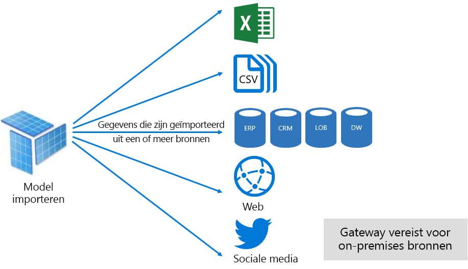

Hoewel er echter aantrekkelijke voor delen zijn gekoppeld aan import modellen, zijn er ook nadelen:

- Het volledige model moet worden geladen in het geheugen voordat Power BI een query kan uitvoeren op het model, dat druk kan plaatsen op beschik bare resources, zoals het aantal en de grootte van modellen groeit
- Model gegevens zijn alleen als actueel van de laatste vernieuwing en daarom moeten import modellen worden vernieuwd, bij voor keur volgens een geplande basis
- Bij een volledige vernieuwing worden alle gegevens uit alle tabellen verwijderd en opnieuw geladen vanuit de gegevens bron. Dit kan zeer kostbaar zijn in termijnen en resources voor de Power BI-service en de gegevens bron (nen). Power BI biedt ondersteuning voor incrementeel vernieuwen, waardoor het niet mogelijk is om volledige tabellen te verwijderen en opnieuw te laden. dit wordt behandeld in het onderwerp [geoptimaliseerde Power bi-gehoste modellen](#optimizing-power-bi-hosted-models) .

Importeer modellen van een Power BI-service resource-perspectief:

- Voldoende geheugen om het model te laden wanneer het wordt opgevraagd of vernieuwd
- Resources en aanvullende geheugen bronnen verwerken om gegevens te vernieuwen

#### DirectQuery-modus

Modellen die in de DirectQuery-modus (DQ) zijn ontwikkeld, importeren geen gegevens. In plaats daarvan bestaan ze alleen uit meta gegevens die bij het opvragen van systeem eigen query's naar de onderliggende gegevens bron worden uitgevoerd.

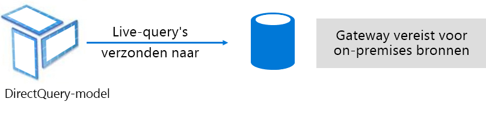

Er zijn twee belang rijke redenen om te overwegen een DQ-model te ontwikkelen. De eerste reden is wanneer gegevens volumes te groot zijn, zelfs wanneer er gegevens reductie methoden worden toegepast, zodat ze in een model worden geladen of nagenoeg worden vernieuwd. De tweede reden is wanneer rapporten en dash boards ' bijna realtime ' gegevens moeten leveren, behalve wat kan worden bereikt binnen de geplande vernieuwings limieten (48 keer per dag voor een toegewezen capaciteit).

Er zijn verschillende voor delen voor DQ-modellen:

- De maximale grootte van het import model is niet van toepassing
- Modellen hoeven niet te worden vernieuwd
- Rapport gebruikers krijgen de laatste gegevens te zien wanneer ze communiceren met rapport filters en slicers, en kunnen het hele rapport vernieuwen om actuele gegevens op te halen
- Dashboard tegels, wanneer deze zijn gebaseerd op DQ-modellen, kunnen automatisch worden bijgewerkt, net zo vaak elke 15 minuten

Er zijn echter talloze nadelen en beperkingen met betrekking tot DQ-modellen:

- Het model moet worden gebaseerd op één ondersteunde gegevens bron, en daarom moet er al een gegevens integratie in de gegevens bron worden behaald. Ondersteunde gegevens bronnen zijn relationele en analytische systemen, met ondersteuning voor veel populaire gegevens archieven \[[7](#endnote-07)\].
- Prestaties kunnen traag zijn, waardoor mogelijk een negatieve invloed op de Power BI-service (query's kunnen zeer CPU-intensief zijn) en op de gegevens bron (die mogelijk niet kan worden geoptimaliseerd voor analyse query's)
- Power Query query's kunnen niet meer complex zijn en zijn beperkt tot M-expressies en-functies die kunnen worden omgezet naar systeem eigen query's die worden geïnterpreteerd door de gegevens bron
- DAX-functies zijn beperkt tot die kunnen worden omgezet naar systeem eigen query's die worden geïnterpreteerd door de gegevens bron, en er is geen ondersteuning voor berekende tabellen of ingebouwde time intelligence-mogelijkheden
- Model query's die meer dan 1.000.000 rijen moeten ophalen, mislukken standaard
- Rapporten en dash boards met meerdere visuals kunnen inconsistente resultaten weer geven, vooral wanneer de gegevens bron vluchtig is
- Q & A en Snelle inzichten worden niet ondersteund

In het perspectief van een Power BI-service resource DQ modellen vereist:

- Mini maal geheugen voor het laden van het model (alleen meta gegevens) wanneer er een query op wordt uitgevoerd
- Soms aanzienlijke processor bronnen voor het genereren en verwerken van query's die worden verzonden naar de gegevens bron

Raadpleeg de [direct query gebruiken in Power bi Desktop](desktop-use-directquery.md) document voor meer informatie.

#### Samengestelde modus

Modellen die in de samengestelde modus zijn ontwikkeld, maken het configureren van de opslag modus voor afzonderlijke model tabellen mogelijk. Het ondersteunt daarom een combi natie van import-en DQ-tabellen. Het ondersteunt ook berekende tabellen (gedefinieerd met DAX) en meerdere DQ-gegevens bronnen.

De tabel opslag modus kan worden geconfigureerd als import, DirectQuery of Dual. Een tabel die is geconfigureerd als dubbele opslag modus is zowel importeren als DirectQuery, en Hiermee kan de Power BI-service de meest efficiënte modus bepalen die op basis van query's moet worden gebruikt voor een query.

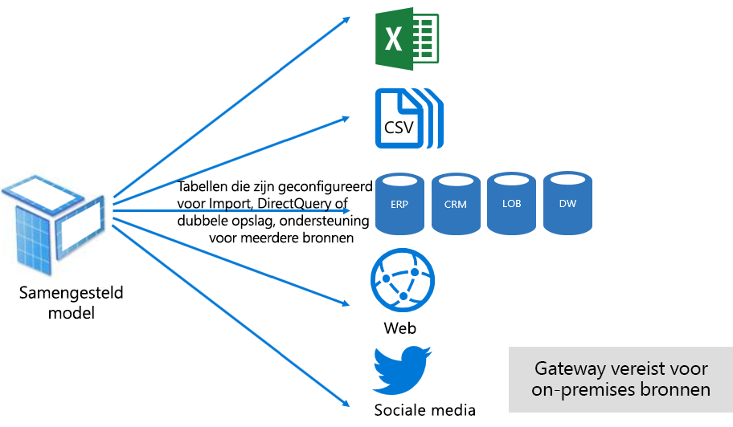

Samengestelde modellen streven ernaar het beste van import-en DirectQuery-modi te leveren. Wanneer ze op de juiste wijze zijn geconfigureerd, kunnen ze hoge query prestaties van in-Memory modellen combi neren met de mogelijkheid om bijna realtime gegevens uit gegevens bronnen op te halen.

Gegevens modelers die samengestelde modellen ontwikkelen, kunnen tabellen met dimensie typen in import-of dubbele opslag modus en feiten type tabellen in de DirectQuery-modus configureren. Denk bijvoorbeeld aan een model met een tabel product dimensie type in de dubbele modus en een tabel met verkoop feiten in de modus DirectQuery. De product tabel kan efficiënt en snel worden opgevraagd uit het geheugen om een rapport slicer weer te geven. De tabel sales kan vervolgens worden opgevraagd in de DirectQuery-modus en is gekoppeld aan de gerelateerde product tabel. De laatste query kan het genereren van een enkele efficiënte systeem eigen query mogelijk maken voor het samen voegen van product-en verkoop tabellen en het filteren van de slicer-waarden.

Over het algemeen kunnen de voor-en nadelen van elke model modus worden beschouwd als het Toep assen op de tabel opslag modus in samengestelde modellen.

Raadpleeg de [samengestelde modellen gebruiken in Power bi Desktop](desktop-composite-models.md) document voor meer informatie.

### Licentieverlening

Power BI heeft drie licenties:

- Gratis versie van Power BI
- Power BI Pro
- Power BI Premium

Met de **Power bi gratis** licentie kan een persoon zich aanmelden bij de Power bi-service en binnen hun persoonlijke werk ruimte werken door modellen en rapporten te publiceren. Het is belang rijk om te begrijpen dat het niet mogelijk is om Power BI inhoud te delen met behulp van deze licentie. Deze licentie, zoals de naam wordt voorgesteld, is gratis.

Met de **Power bi Pro** licentie kan een individu maken en samen werken in werk ruimten en Power bi inhoud delen en distribueren. Ze kunnen ook vernieuwen configureren voor hun gegevens sets, zodat ze automatisch actueel blijven, met inbegrip van on-premises gegevens bronnen. Daarnaast kunnen ze controleren en bepalen hoe gegevens worden geopend en gebruikt. Deze licentie is vereist voor het ontvangen van gedeelde inhoud van anderen, tenzij de gebruiker is gekoppeld aan een Power BI Premium toegewezen capaciteit.

De **Power bi Premium** licentie is een licentie op Tenant niveau en wordt beschreven in de sectie [Inleiding Power bi Premium](#introducing-power-bi-premium) .

Raadpleeg de pagina met [Power bi prijzen](https://powerbi.microsoft.com/pricing/) voor meer informatie over Power bi-licenties.

## Inleiding tot Power BI Premium

Power BI Premium levert een Unified self-service-en Enter prise BI-platform met schaal, betrouw bare prestaties en voorspel bare kosten. Dit wordt voornamelijk gerealiseerd door speciale resources op te geven voor het uitvoeren van de Power BI-service voor uw organisatie.

Daarnaast biedt Power BI Premium een groot aantal ondernemings functies:

- Rendabele inhouds distributie, waardoor het delen van Power BI inhoud kan worden beperkt tot onbeperkte Power BI gratis gebruikers, met inbegrip van externe gebruikers
- Ondersteuning voor grotere gegevensset-grootten \[[8](#endnote-08)\]
- Hogere vernieuwings snelheden van gegevens stromen en gegevens sets (Maxi maal 48 keer per dag)
- Incrementeel vernieuwen van gegevens stromen en gegevens sets
- Gekoppelde gegevensstroom eenheden en parallelle uitvoering van trans formaties
- Gepagineerde rapporten
- Power BI Report Server, voor on-premises rapportage
- Mogelijkheid om inhoud in apps in te sluiten namens app-gebruikers (PaaS)

Veel van deze functies kunnen worden gebruikt voor het leveren van efficiënte en schaal bare oplossingen voor ondernemingen en zijn opgenomen in de sectie [Premium-capaciteiten optimaliseren](#optimizing-premium-capacities) .

### Abonnementen en licenties

Power BI Premium is een Office 365-abonnement op tenantniveau beschikbaar in twee SKU-families (SKU: Stock Keeping Unit):

- **Em** Sku's (EM1-EM3) voor insluiten, vereist een jaarlijkse toezeg ging, maandelijks gefactureerd
- **P** -Sku's (P1-P3) voor insluiting-en Enter prise-functies, waarvoor maandelijks of jaarlijks een toezeg ging is vereist, maandelijks wordt gefactureerd en een licentie bevat om Power bi Report Server on-premises te installeren

Een alternatieve methode is het aanschaffen van een Azure Power BI Embedded-abonnement dat één SKU-familie heeft: **een** Sku's (a1-A6) voor het gebruik van insluitings-en capaciteits tests.

Alle Sku's leveren v-cores voor het maken van capaciteit \[[9](#endnote-09)\], maar de em-sku's zijn beperkt voor het insluiten van kleinere schalen. De focus van dit technisch document bevindt zich op de P-Sku's, maar veel van de besproken informatie is ook relevant voor de A-Sku's.

In tegenstelling tot de SKU's van het Premium-abonnement zijn voor Azure-SKU's geen tijdsverplichtingen vereist. Deze worden per uur gefactureerd. Ze bieden volledige elasticiteit in het omhoog en omlaag aanpassen van de schaal, en het onderbreken, hervatten en verwijderen van capaciteit.

Azure Power BI Embedded is grotendeels buiten het bereik voor dit technisch document, maar het wordt in het onderwerp test benaderingen besproken als een praktische en economische optie voor het testen en meten van werk belastingen.

Raadpleeg de [documentatie van azure Power bi embedded](/azure/power-bi-embedded/)voor meer informatie over de Azure-sku's.

Power BI Premium-abonnementen worden aangeschaft door beheerders in het Microsoft 365-beheercentrum. In het bijzonder kunnen alleen globale beheerders of facturerings beheerders van Office 365 Sku's kopen.

Na de aankoop ontvangt de Tenant een bijbehorend aantal v-cores dat aan de capaciteiten kan worden toegewezen. dit wordt ook wel **v-core-pooling**genoemd. Als u bijvoorbeeld een P3-SKU koopt, ontvangt de tenant 32 v-cores.

Zie Power BI Premium-document [aanschaffen](service-admin-premium-purchase.md) voor meer informatie.

### Premium-capaciteit

In tegens telling tot een gedeelde capaciteit waarbij workloads worden uitgevoerd op reken resources die worden gedeeld met andere klanten, geldt een **toegewezen capaciteit** voor exclusief gebruik door een organisatie. Het is geïsoleerd met toegewezen reken resources die betrouw bare en consistente prestaties bieden voor gehoste inhoud.

De focus van dit technisch document is een **Premium-capaciteit** , wat betekent dat deze is gekoppeld aan een van de em-of P-sku's.

#### Capaciteitsknooppunten

Zoals beschreven in het onderwerp abonnementen en licenties, zijn er twee Power BI Premium SKU-families: EM en P. Alle Power BI Premium Sku's zijn beschikbaar als capaciteits knooppunten, met elk een ingestelde hoeveelheid resources die bestaan uit processor, geheugen en opslag. Naast de bronnen heeft elke SKU operationele limieten voor het aantal DirectQuery-verbindingen (DQ) en de verbinding met de krediet brief (LC) per seconde en het aantal vernieuwingen van parallelle modellen.

De verwerking vindt plaats door een vast aantal v-cores, evenredig verdeeld over back-end en front-end.

De **back-end-v-cores** zijn verantwoordelijk voor de Power BI-kernfunctionaliteit, waaronder verwerken van query's, cachebeheer, uitvoeren van R-services, vernieuwen van modellen, natuurlijke taalverwerking (Q&A) en het weergeven van rapporten en afbeeldingen op de server. Back-end-v-cores worden toegewezen aan een vaste hoeveelheid geheugen die primair wordt gebruikt voor het hosten van modellen die ook wel actieve gegevens sets worden genoemd.

Front **-End-v-cores** zijn verantwoordelijk voor de webservice, het document beheer voor dash boards en rapporten, het beheren van de toegangs rechten, de planning, api's, uploads en down loads, en over het algemeen voor alles met betrekking tot de gebruikers ervaring.

Opslag is ingesteld op 100 TB per capaciteits knooppunt.

De resources en limieten van elke Premium-SKU (en een vergelijk bare grootte van een SKU) worden in de volgende tabel beschreven.

| Capaciteitsknooppunten | Totaal aantal v-cores | v-cores voor back-end | RAM (GB) | v-cores voor front-end | DQ/LC (per seconde) | Model voor parallelle vernieuwing |
| --- | --- | --- | --- | --- | --- | --- |
| EM1/A1 | 1 | 0,5 | 3 | 0,5 | 3,75 | 1 |
| EM2/A2 | 2 | 1 | 5 | 1 | 7,5 | 2 |
| EM3/A3 | 4 | 2 | 10 | 2 | 15 | 3 |
| P1/A4 | 8 | 4 | 25 | 4 | 30 | 6 |
| P2/A5 | 16 | 8 | 50 | 8 | 60 | 12 |
| P3/A6 | 32 | 16 | 100 | 16 | 120 | 24 |
| | | | | | | |

#### Werk belastingen voor capaciteit

Workloads van capaciteit zijn services die beschikbaar zijn gesteld aan gebruikers. Standaard bieden Premium-en Azure-capaciteiten alleen ondersteuning voor een werk belasting van de gegevensset die is gekoppeld aan het uitvoeren van Power BI query's die niet kunnen worden uitgeschakeld.

Extra workloads kunnen worden ingeschakeld voor gepagineerde rapporten, gegevens stromen en AI. Voor elke extra workload moet het maximum geheugen worden geconfigureerd (als percentage van het totale beschik bare geheugen) dat door de werk belasting kan worden gebruikt.

#### De functie capaciteit

De Power BI-service streeft altijd om het beste gebruik te maken van capaciteits bronnen zonder dat de limieten voor de capaciteit worden overschreden.

Capaciteits bewerkingen worden geclassificeerd als interactief of op de achtergrond. Interactieve bewerkingen zijn onder meer het weergeven van aanvragen van en reageren op interactie van gebruikers (filteren, query's op Q&A uitvoeren enzovoort). Over het algemeen is het importeren van een model het uitvoeren van een query naar een geheugen bron, terwijl het uitvoeren van query's in de DQ-modellen van het type CPU-intensief is. Bewerkingen op de achtergrond zijn onder meer de vernieuwing van gegevensstroom- en importmodellen en het opslaan van dashboardquery's in het cachegeheugen.

Het is belang rijk om te begrijpen dat interactieve bewerkingen altijd op de achtergrond worden uitgevoerd om de best mogelijke gebruikers ervaring te garanderen. Als er onvoldoende resources zijn, worden de bewerkingen op de achtergrond aan een wachtrij toegevoegd om te worden verwerkt wanneer resources vrijkomen. Achtergrond bewerkingen, zoals het vernieuwen van de gegevensset en AI-functies, kunnen worden gestopt door de Power BI-service en worden toegevoegd aan een wachtrij.

Importeer modellen moeten volledig in het geheugen worden geladen, zodat ze kunnen worden opgevraagd of vernieuwd. De Power BI-service beheert het geheugen gebruik met behulp van geavanceerde algoritmen om het maximale gebruik van het beschik bare geheugen te garanderen, en kan de capaciteit overzetten: Hoewel het mogelijk is om veel import modellen op te slaan (Maxi maal 100 TB per Premium-capaciteit), Wanneer de gecombineerde schijf opslag het ondersteunde geheugen overschrijdt (en er is extra geheugen vereist voor het uitvoeren van query's en vernieuwen), kunnen ze niet allemaal tegelijk in het geheugen worden geladen.

Import modellen worden daarom geladen in-en verwijderd uit het geheugen volgens gebruik. Er wordt een import model geladen wanneer het wordt opgevraagd (interactieve bewerking) en nog niet in het geheugen, of wanneer het wordt vernieuwd (achtergrond bewerking).

Het verwijderen van een model uit het geheugen wordt **verwijderd** , en het is een bewerking die Power bi snel kan worden uitgevoerd, afhankelijk van de grootte van de modellen. Als zich in de capaciteit niet een geheugendruk voordoet, is het eenvoudig om modellen in het geheugen te laden en daar te houden. \[[10](#endnote-10)\] echter, wanneer er onvoldoende geheugen beschikbaar is om een model te laden, moet de Power bi-service eerst geheugen vrij te maken. Het maakt geheugen vrij door modellen te detecteren die inactief zijn geworden door modellen te zoeken die in de afgelopen drie minuten niet zijn gebruikt \[[11](#endnote-11)\]en vervolgens te verwijderen. Als er geen inactieve modellen zijn om te verwijderen, gaat Power BI-service modellen verwijderen die zijn geladen voor bewerkingen op de achtergrond. Dit kan ook betrekking hebben op het verwijderen van achtergrond werkbelastingen, zoals de AI-werk belasting. Een laatste redmiddel, na 30 seconden mislukte pogingen \[[11](#endnote-11)\], kan de interactieve bewerking niet uitvoeren. In dit geval wordt de rapport gebruiker op de hoogte gesteld van een fout met een suggestie om het opnieuw te proberen.

Het is belang rijk om te stressn dat het verwijderen van de gegevensset een normaal en verwacht gedrag is. Er wordt gestreefd naar een maximaal geheugengebruik door het laden en verwijderen van modellen waarvan de gecombineerde omvang groter kan zijn dan het beschikbare geheugen. Dit is zo bedoeld, en het is volledig transparant voor gebruikers van rapporten. Hoge aantallen verwijderingen betekenen niet noodzakelijkerwijs dat de capaciteit van onvoldoende resources is voorzien. Dit kan echter een probleem worden als de reactietijd voor query's of vernieuwen lijdt onder de hoge aantallen verwijderingen.

Het vernieuwen van import modellen is altijd geheugen intensief omdat modellen moeten worden geladen in het geheugen en er extra geheugen nodig is voor de verwerking. Volledig vernieuwen kan ongeveer de dubbele hoeveelheid geheugen gebruiken die nodig is voor het model. Dit zorgt ervoor dat het model kan worden opgevraagd, zelfs wanneer het wordt verwerkt (query's worden verzonden naar het bestaande model, totdat het vernieuwen is voltooid en de gegevens van het nieuwe model beschikbaar zijn). Houd er rekening mee dat incrementeel vernieuwen minder geheugen nodig heeft en sneller kan worden voltooid, waardoor de druk op capaciteits bronnen aanzienlijk kan verminderen. Vernieuwen kan ook een zware belasting voor modellen vormen, met name de modellen met complexe Power Query-transformaties of berekende tabellen/kolommen die complex zijn of zijn gebaseerd op grote tabellen.

Vernieuwen als query's: vereist dat het model in het geheugen wordt geladen. Als er onvoldoende geheugen is, probeert Power BI-service inactieve modellen te verwijderen, en als dit niet mogelijk is (als alle modellen actief zijn), wordt de vernieuwingstaak in de wachtrij geplaatst. Vernieuwingen zijn doorgaans zeer CPU-intensief, nog meer dan query's. Hierom zijn er capaciteitsbeperkingen op het aantal gelijktijdige vernieuwingen, dat is ingesteld op 1,5 keer het aantal back-end-v-cores, naar boven afgerond. Als er te veel gelijktijdige vernieuwingen plaatsvinden, wordt een geplande vernieuwing in de wachtrij geplaatst. Wanneer deze situaties zich voordoen, duurt het langer voordat de vernieuwing is voltooid. Houd er rekening mee dat op aanvraag vernieuwt (geactiveerd door een gebruikers aanvraag of API-aanroep) drie keer opnieuw wordt \[[11](#endnote-11)\]en dat er een fout optreedt als er nog steeds niet voldoende resources zijn.

## Power BI Premium beheren

Het beheren van Power BI Premium omvat het kopen van abonnementen en het maken, beheren en controleren van Premium-capaciteit.

### Capaciteiten maken en beheren

Op de pagina **capaciteits instellingen** van de **Power bi-beheer** portal wordt het aantal v-cores weer gegeven dat is gekocht en beschikbaar (en dat nog moet worden toegewezen aan een capaciteit) en worden Premium-capaciteiten weer gegeven. Op de pagina kunnen Office 365 globale beheerders of Power BI-service beheerders Premium-capaciteit maken op basis van beschik bare v-cores of bestaande Premium-capaciteiten wijzigen.

Bij het maken van een Premium-capaciteit moet de beheerder het volgende definiëren:

- Capaciteits naam (uniek binnen de Tenant)
- Capaciteits beheerder (s)
- Capaciteitsgrootte
- Regio voor data locatie \[[12](#endnote-12)\]

Er moet minstens één capaciteitsbeheerder worden aangewezen. Gebruikers die zijn aangewezen als capaciteitsbeheerder kunnen het volgende doen:

- Werk ruimten toewijzen aan de capaciteit
- Gebruikers machtigingen beheren, extra capaciteits beheerders of gebruikers met toewijzings machtigingen toevoegen (om ze in staat te stellen om werk ruimten toe te wijzen aan de capaciteit)
- Werk belastingen beheren, voor het configureren van het maximale geheugen gebruik voor gepagineerde rapporten en gegevens stromen-workloads
- Start de capaciteit opnieuw op om alle bewerkingen in het geval van een systeem overbelasting \[[13](#endnote-13)\] opnieuw in te stellen

Capaciteits beheerders hebben geen toegang tot de inhoud van de werk ruimte (tenzij expliciet toegewezen werkruimte machtigingen) en hebben geen toegang tot alle Power BI beheerders gebieden (tenzij expliciet toegewezen), zoals metrische gegevens over het gebruik, controle Logboeken of Tenant instellingen. Belangrijker is dat capaciteitsbeheerders geen machtigingen hebben om nieuwe capaciteiten te maken of bestaande capaciteiten te schalen. Ze worden ook per capaciteit toegewezen, zodat ze alleen de capaciteit kunnen bekijken en beheren waaraan ze zijn toegewezen.

Capaciteits grootte moet worden geselecteerd in een lijst met beschik bare SKU-opties die worden beperkt door het aantal beschik bare v-cores in de pool. Het is mogelijk om meerdere capaciteiten te maken op basis van de pool die kan worden gebrond op basis van een of meer gekochte Sku's. Bijvoorbeeld een P3-SKU (32 v-cores) kan worden gebruikt om drie capaciteiten te maken: een P2 (16 v-cores) en twee keer een P1 (2 x 8 v-cores). Verbeterde prestaties en schaal baarheid kan worden bereikt door kleinere, grote capaciteit te maken en dit onderwerp wordt beschreven in de sectie [Premium-capaciteiten optimaliseren](#optimizing-premium-capacities) . In de volgende afbeelding ziet u een voor beeld van een configuratie voor de fictieve Contoso-organisatie die bestaat uit vijf Premium-capaciteiten (3 x P1 en 2 x P3) met elke werk ruimte en verschillende werk ruimten in gedeelde capaciteit.

Een Premium-capaciteit kan worden toegewezen aan een andere regio dan de regio thuis van de Power BI Tenant, waarmee u beheer taken kunt uitvoeren over welke data centers (binnen gedefinieerde geografische gebieden) Power BI inhoud zich bevindt. \[[12](#endnote-12)\]

Power BI-servicebeheerders en globale Office 365-beheerders kunnen Premium-capaciteiten bewerken. In het bijzonder is het volgende mogelijk:

- Wijzig de capaciteits grootte om resources omhoog of omlaag te schalen. Het is echter niet mogelijk om een P SKU te downgradeen naar een EM-SKU of andersom te upgraden.
- Capaciteits beheerders toevoegen of verwijderen
- Gebruikers met toewijzings machtigingen toevoegen of verwijderen
- Extra werk belastingen toevoegen of verwijderen
- Regio's wijzigen

Er zijn toewijzingsmachtigingen nodig om een werkruimte toe te wijzen aan een specifieke Premium-capaciteit. De machtigingen kunnen worden verleend aan de hele organisatie, specifieke gebruikers of groepen.

Standaard ondersteunen Premium-capaciteiten workloads die aan de uitvoering van Power BI-query's zijn gekoppeld. Het ondersteunt ook drie extra workloads: **gepagineerde rapporten**, **gegevens stromen**en **AI**. Voor elke workload moet u de maximale hoeveelheid geheugen configureren (als percentage van het totaal aan beschikbaar geheugen) die door de workload kan worden gebruikt. Het is belang rijk om te begrijpen dat het toenemende aantal geheugen toewijzingen kan invloed hebben op het aantal actieve modellen dat kan worden gehost en de door Voer van vernieuwen.

Geheugen wordt dynamisch toegewezen aan gegevensstromen, maar in het geval van gepagineerde rapporten betreft het een statische toewijzing. De reden voor een statische toewijzing van het maximumgeheugen is dat gepagineerde rapporten worden uitgevoerd binnen een beveiligde ruimte van de capaciteit. Het geheugen van gepagineerde rapporten moet zorgvuldig worden ingesteld, aangezien dat het beschikbare geheugen voor het laden van modellen beperkt.

|                     | EM3                      | P1                       | P2                      | P3                       |
|---------------------|--------------------------|--------------------------|-------------------------|--------------------------|
| Gepagineerde rapporten | N.v.t. | standaard 20%; minimaal 10% | standaard 20%; minimaal 5% | standaard 20%; minimaal 2,5% |
| Gegevensstromen | standaard 20%; minimaal 8%  | standaard 20%; minimaal 4%  | standaard 20%; minimaal 2% | standaard 20%; minimaal 1%  |
| AI | N.v.t. | Standaard 20%; minimaal 20%  | standaard 20%; minimaal 10% | standaard 20%; minimaal 5%  |
| | | | | |

Het verwijderen van een Premium-capaciteit is mogelijk en leidt er niet toe dat de werk ruimten en inhoud worden verwijderd. In plaats daarvan worden toegewezen werk ruimten verplaatst naar de gedeelde capaciteit. Wanneer de Premium-capaciteit in een andere regio is gemaakt, wordt de werk ruimte verplaatst naar de gedeelde capaciteit van de regio thuis.

### Werk ruimten toewijzen aan capaciteiten

U kunt werk ruimten toewijzen aan een Premium-capaciteit in de **Power bi beheer**  **Portal** of-voor een werk ruimte, in het deel venster **werk ruimte** .

Capaciteits beheerders, evenals Office 365 globale beheerders of Power BI-service beheerders, kunnen in de **Power bi beheer**  **Portal**bulksgewijs werk ruimten toewijzen. Bulksgewijs toewijzen is van toepassing op:

- **Werk ruimten van gebruikers** : alle werk ruimten die eigendom zijn van deze gebruikers, waaronder persoonlijke werk ruimten, worden toegewezen aan de Premium-capaciteit. Dit omvat de nieuwe toewijzing van werk ruimten wanneer deze al zijn toegewezen aan een andere Premium-capaciteit. Bovendien krijgen ook de gebruikers toewijzingsmachtigingen voor werkruimten toegewezen.

- **Specifieke werkruimten**
- **De werk ruimten van de hele organisatie** : alle werk ruimten, waaronder persoonlijke werk ruimten, worden toegewezen aan de Premium-capaciteit. Daarnaast worden aan alle huidige en toekomstige gebruikers machtigingen voor werkruimte toewijzingen toegewezen. \[[14](#endnote-14)\]

Er kan een werkruimte worden toegevoegd aan een Premium-capaciteit via het venster **Werkruimte**, mits de gebruiker een werkruimtebeheerder is en toewijzingsmachtigingen heeft.

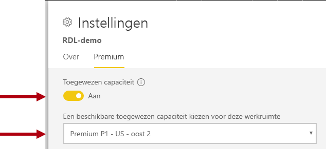

Werkruimtebeheerders kunnen een werkruimte verwijderen uit een capaciteit (naar een gedeelde capaciteit) en hebben daar geen toewijzingsmachtigingen voor nodig. Als werkruimten worden verwijderd uit toegewezen capaciteiten, wordt de werkruimte in praktijk naar een gedeelde capaciteit verplaatst. Houd er rekening mee dat de verwijdering van een werkruimte uit een Premium-capaciteit mogelijk negatieve gevolgen heeft. Gedeelde inhoud is mogelijk niet meer beschikbaar voor gelicentieerde gebruikers van de gratis versie van Power BI, of gepland vernieuwen wordt mogelijk opgeschort wanneer de door gedeelde capaciteiten ondersteunde limieten worden overschreden.

In de Power BI-service is een werkruimte die is toegewezen aan een Premium-capaciteit makkelijk te herkennen aan een diamant naast de naam van de werkruimte.

### Bewakings capaciteit

De bewaking van Premium-capaciteiten biedt beheerders inzicht in de prestaties van capaciteiten. Capaciteiten kunnen worden bewaakt met behulp van de [Power bi Premium capaciteits-app voor gegevens](service-admin-premium-monitor-capacity.md) of de [Power bi beheer Portal](service-admin-premium-monitor-portal.md).

#### Metrische gegevens interpreteren

Metrische gegevens moeten worden bewaakt voor een basisbegrip van resourcegebruik en workloadactiviteit. Als de capaciteit langzamer wordt, is het belangrijk te begrijpen welke metrische gegevens moeten worden bewaakt en welke conclusies u kunt trekken.

In het ideale geval moeten query's binnen een seconde zijn voltooid voor een reactieve ervaring bij rapportgebruikers en voor een hogere doorvoer van query's. Het is meestal minder erg dat processen op de achtergrond, waaronder vernieuwingen, langer duren.

Over het algemeen zijn langzame rapporten een indicatie van een overbelaste capaciteit. Wanneer rapporten niet worden geladen, is dit een indicatie van een overbelaste capaciteit. In beide gevallen kan de hoofdoorzaak in veel factoren worden gezocht, waaronder:

- **Mislukt query's**. Die geven een zekere geheugendruk aan en dat een model niet kan worden geladen in het geheugen. De Power BI-service probeert een model 30 seconden lang te laden voordat het mislukt.

- **Buitensporige querywachttijden**. Dit heeft mogelijk meerdere oorzaken:
  - De nood zaak van de Power BI-service eerst model (en) te verwijderen en vervolgens het to-to-to-to-to-query-model te laden (in de wachtrij staan dat hogere tarieven voor het verwijderen van de gegevensset geen indicatie zijn van de capaciteits belasting, tenzij dit vergezeld gaat van lange wacht tijden voor query's die duiden op geheugen overbelasting)
  - Laad tijden van het model (met name de wacht tijd om een groot model in het geheugen te laden)
  - Langlopende query's
  - Te veel LC\DQ-verbindingen (meer dan capaciteits limieten)
  - CPU-verzadiging
  - Complexe rapport ontwerpen met een uitzonderlijk groot aantal visuele elementen op een pagina (u herinnert dat elke Visual een query is)
- **Een lange queryduur** geeft mogelijk aan dat modelontwerpen niet zijn geoptimaliseerd, in het bijzonder wanneer meerdere gegevenssets actief zijn in een capaciteit en maar één gegevensset voor een lange queryduur zorgt. Dit geeft aan dat de capaciteit voldoende resources heeft en dat de betreffende gegevensset suboptimaal of gewoon langzaam is. Langdurige query's kunnen problematisch zijn, omdat ze de toegang tot resources blokkeren die andere processen nodig hebben.
- **Lange wacht tijden voor vernieuwen of de wacht tijden voor AI-aanroepen** geven onvoldoende geheugen aan als gevolg van veel actieve modellen die geheugen gebruiken, of waardoor het vernieuwen van het probleem andere vernieuwingen blokkeert (boven parallelle vernieuwings limieten).

Meer gedetailleerde uitleg over het gebruik van de metrische gegevens vindt u in de sectie [Premium-capaciteiten optimaliseren](#optimizing-premium-capacities) .

## Premium-capaciteiten optimaliseren

Wanneer er problemen met de prestaties van Premium-capaciteit optreden, is een algemene eerste benadering het optimaliseren of afstemmen van reeds geïmplementeerde oplossingen om acceptabele reactie tijden te herstellen. Het onderdrukken van de motivering is om te voor komen dat extra Premium-capaciteit wordt aangeschaft, tenzij dit gerechtvaardigd kan zijn.

Wanneer extra Premium-capaciteit is vereist, zijn er twee opties die verderop in deze sectie worden besproken:

- De Premium-capaciteit omhoog schalen
- Nieuwe Premium-capaciteit toevoegen

Ten slotte sluiten de test benaderingen en de grootte van Premium-capaciteit deze sectie.

### Algemene aanbevolen procedures

Bij het streven naar het beste gebruik en de prestaties zijn er een aantal aanbevolen procedures die aan boord als algemene aanbevelingen kunnen worden genomen. Deze omvatten:

- Werk ruimten gebruiken in plaats van persoonlijke werk ruimten
- Bedrijfskritische en self-service BI (SSBI) scheiden in verschillende capaciteiten

  

- Als inhoud alleen delen met Power BI Pro gebruikers, is het niet nodig om de inhoud op te slaan in een toegewezen capaciteit
- Gebruik toegewezen capaciteit bij het zoeken naar een specifieke vernieuwings tijd of wanneer specifieke functies vereist zijn, bijvoorbeeld grote gegevens sets of gepagineerde rapporten

### Algemene vragen adresseren

Optimalisatie van Power BI Premium-implementaties is een complex onderwerp dat betrekking heeft op de behoeften van de werk belasting, beschik bare bronnen en het effectief gebruik ervan.

In dit onderwerp worden zeven algemene ondersteunings vragen beschreven, met een beschrijving van mogelijke problemen en uitleg, en informatie over het identificeren en oplossen ervan.

#### Waarom is de capaciteit traag en wat kan ik doen?

Er zijn vele redenen waardoor Premium-capaciteit traag kan worden. Voor deze vraag is meer informatie nodig om te begrijpen wat met 'traag' wordt bedoeld. Duurt het lang voordat rapporten zijn geladen? Of kunt u deze helemaal niet laden? Duurt het lang voordat visuals in rapporten zijn geladen of bijgewerkt wanneer gebruikers het rapport gebruiken? Worden vernieuwingen langer uitgevoerd dan verwacht of eerder ervaring ondernomen?

Wanneer u de oorzaak weet, kunt u het probleem gaan onderzoeken. Op basis van de antwoorden op de volgende zes vragen kunt u specifiekere problemen oplossen.

#### Door welke inhoud wordt mijn capaciteit verbruikt?

U kunt de app **Power BI Premium-app voor metrische gegevens van capaciteit** gebruiken om de inhoud op capaciteit te filteren en de metrische gegevens over de prestaties voor inhoud uit de werkruimte controleren. Het is mogelijk om de metrische gegevens over prestaties en het resource gebruik per uur te bekijken voor de afgelopen zeven dagen voor alle inhoud die is opgeslagen in een Premium-capaciteit. Dit is vaak de eerste stap bij het oplossen van problemen met een algemene bezorgdheid over de prestaties van de Premium-capaciteit.

Dit zijn de belangrijkste metrische gegevens om te controleren:

- Gemiddeld aantal CPU-en hoog gebruik
- Gemiddeld geheugen en aantal gebruik en geheugen gebruik voor specifieke gegevens sets, gegevens stromen en gepagineerde rapporten
- Actieve gegevens sets geladen in het geheugen
- Gemiddelde en maximale duur van query's
- Gemiddelde wacht tijden voor query's
- Gemiddelde vernieuwings tijden voor gegevensset en gegevensstroom
- Gemiddelde AI-aanroep tijden en wacht tijden

In de Power BI Premium capacity Metrics-app wordt in het actieve geheugen bovendien de totale hoeveelheid geheugen weer gegeven die is toegewezen aan een rapport dat niet kan worden verwijderd omdat het in de laatste drie minuten in gebruik is. Een hoge piek in de wachttijd voor vernieuwen kan wijzen op een grote en/of actieve gegevensset.

In de grafiek ' Top 5 op gemiddelde duur ' worden de vijf meest voorkomende gegevens sets, gepagineerde rapporten, gegevens stromen en AI-aanroepen voor het verbruiken van capaciteits bronnen gemarkeerd. Inhoud in de top vijf lijsten is kandidaten voor onderzoek en mogelijke optimalisatie.

#### Waarom duurt het lang voordat rapporten zijn geladen?

In de volgende tabellen staan mogelijke problemen en manieren om ze te identificeren en op te lossen.

##### Onvoldoende capaciteitsresources

| Mogelijke verklaringen | Instructies voor identificeren | Instructies voor oplossen |
| --- | --- | --- |
| Hoog totaal actief geheugen (model kan niet worden verwijderd omdat het in de afgelopen drie minuten wordt gebruikt)   Meerdere hoge pieken in wacht tijden van query's   Meerdere hoge pieken in wacht tijden voor vernieuwen | Bewaak de metrische geheugen gegevens \[[18](#endnote-18)\]en het aantal verwijderingen \[[19](#endnote-19)\] | De model grootte verlagen of converteren naar de DirectQuery-modus: Zie het onderwerp [modellen optimaliseren](#optimizing-models) in deze sectie   De capaciteit omhoog schalen   De inhoud toewijzen aan een andere capaciteit |

##### Onvoldoende rapportontwerpen

| Mogelijke verklaringen | Instructies voor identificeren | Instructies voor oplossen |
| --- | --- | --- |
| Rapport pagina's bevatten talloze visuele elementen (interactieve filtering kan ten minste één query per Visual activeren)   Met visuele elementen worden meer gegevens opgehaald dan nodig zijn | Rapport ontwerpen controleren   Functionerings rapport gebruikers om te begrijpen hoe ze communiceren met de rapporten   Metrische query gegevens van gegevensset \[[20](#endnote-20)\] bewaken | Rapporten opnieuw ontwerpen met minder visuele elementen per pagina |

##### Gegevensset langzaam (vooral wanneer rapporten eerder zijn uitgevoerd)

| Mogelijke verklaringen | Instructies voor identificeren | Instructies voor oplossen |
| --- | --- | --- |
| Gegevens importeren in steeds grotere aantallen   Complexe of inefficiënte reken logica, inclusief beveiliging op rijniveau   Model niet volledig geoptimaliseerd   (DQ/LC) Gateway latentie   Trage reactie tijden voor DQ-bron query's | Model ontwerpen controleren   Prestatie meter items van de gateway controleren | Zie het onderwerp [modellen optimaliseren](#optimizing-models) in deze sectie |

##### Hoog gebruik van gelijktijdige rapporten

| Mogelijke verklaringen | Instructies voor identificeren | Instructies voor oplossen |
| --- | --- | --- |
| Hoge wacht tijden voor query's   CPU-verzadiging   Limieten voor DQ/LC-verbindingen overschreden | CPU-gebruik bewaken \[[21](#endnote-21)\], wacht tijden voor QUERY'S en dQ/LC-gebruik \[[22](#endnote-22)\] metrische gegevens en duur van query's: als schommelingen kunnen duiden op problemen met gelijktijdigheid | De capaciteit omhoog schalen of de inhoud toewijzen aan een andere capaciteit   Rapporten opnieuw ontwerpen met minder visuele elementen per pagina |

#### Waarom worden rapporten niet geladen?

Wanneer rapporten niet worden geladen, is het een slechtste scenario en een zeker teken dat de capaciteit onvoldoende geheugen heeft en te veel-verwarmd is. Dit kan optreden wanneer actieve query's worden uitgevoerd op alle geladen modellen (die dan dus niet kunnen worden verwijderd) en alle vernieuwingsbewerkingen zijn onderbroken of vertraagd. De Power BI-service probeert de gegevensset 30 seconden lang te laden en de gebruiker krijgt een melding over de fout, met het verzoek het later opnieuw te proberen.

Momenteel zijn er geen metrische gegevens om te controleren op fouten tijdens het laden van rapporten. U kunt controleren of er een kans bestaat dat dit probleem zich voordoet door het systeemgeheugen in de gaten te houden, met name het hoogste gebruik en de tijd waarop het hoogste gebruik plaatsvindt. Een groot aantal gegevenssetverwijderingen en een lange gemiddelde wachttijd voor vernieuwing van gegevenssets kan erop duiden dat dit probleem zich voordoet.

Als dit maar zelden gebeurt, wordt dit niet als een probleem met hoge prioriteit beschouwd. Rapportgebruikers worden geïnformeerd dat de service in gebruik is en dat ze het later opnieuw moeten proberen. Als dit regelmatig gebeurt, kunt u het probleem oplossen door de Premium-capaciteit omhoog te schalen of door de inhoud aan een andere capaciteit toe te wijzen.

Capaciteitsbeheerders (en Power BI-servicebeheerders) kunnen de metrische gegevens over de **Queryfouten** controleren om te bepalen wanneer dit probleem zich voordoet. Ook kunnen ze de capaciteit opnieuw opstarten, zodat alle bewerkingen opnieuw worden ingesteld als het systeem is overbelast.

#### Waarom worden vernieuwingen niet volgens het schema gestart?

Geplande begintijden voor vernieuwen kunnen niet worden gegarandeerd. Onthoud dat de Power BI-service interactieve bewerkingen altijd een hogere prioriteit geeft dan bewerkingen op de achtergrond. Vernieuwen is een achtergrondbewerking die optreedt wanneer er aan twee voorwaarden is voldaan:

- Er is voldoende geheugen
- Het aantal ondersteunde gelijktijdige vernieuwingen voor de Premium-capaciteit wordt niet overschreden

Wanneer er niet aan deze voorwaarden wordt voldaan, wordt de vernieuwing in de wachtrij geplaatst totdat er wel aan de voorwaarden is voldaan.

Let op: voor een volledige vernieuwing is ten minste het dubbele van de huidige geheugengrootte van de gegevensset vereist. Als er niet voldoende geheugen beschikbaar is, kan de vernieuwing pas worden gestart zodra er geheugen vrijkomt doordat er modellen zijn verwijderd. Dit betekent vertraging totdat een of meer gegevenssets inactief zijn geworden en kunnen worden verwijderd.

Let op: het ondersteunde maximumaantal gelijktijdige vernieuwingen wordt ingesteld op 1,5 keer het aantal back-end v-cores (afgerond).

Geplande vernieuwingen kunnen niet worden uitgevoerd als deze niet kunnen worden gestart vóór de volgende geplande vernieuwing wordt gestart. Een on-demand vernieuwing die handmatig is geactiveerd vanuit de gebruikersinterface wordt drie keer geprobeerd voordat dit mislukt.

Capaciteitsbeheerders (en Power BI-servicebeheerders) kunnen de metrische gegevens over de **Gemiddelde wachttijd voor vernieuwen (minuten)** controleren om de gemiddelde vertraging tussen de geplande tijd en de start van de bewerking te bepalen.

Hoewel dit doorgaans geen administratieve prioriteit heeft, moet u ervoor zorgen dat er voldoende geheugen beschikbaar is om ervoor te zorgen dat gegevens op tijd worden vernieuwd. Mogelijk moet u hiervoor gegevenssets isoleren naar capaciteiten waarvan u weet dat hier voldoende resources beschikbaar zijn. Het is ook mogelijk dat beheerders kunnen coördineren met eigen aren van gegevensset om de geplande tijden voor het vernieuwen van gegevens te helpen spreiden of te verminderen om conflicten te minimaliseren. Het is niet mogelijk om een beheerder de vernieuwings wachtrij te bekijken of om gegevensset-schema's op te halen.

#### Waarom duurt het lang voordat mijn gegevens zijn vernieuwd?

Het vernieuwen van gegevens kan lang duren of lang lijken te duren (zoals in de vorige algemene vraag wordt behandeld).

Wanneer het daadwerkelijk lang duurt voordat gegevens zijn vernieuwd, kan dit diverse oorzaken hebben:

- Onvoldoende CPU (vernieuwen kan zeer CPU-intensief zijn)
- Er is onvoldoende geheugen, waardoor het vernieuwen wordt hervat (waardoor het vernieuwen moet worden gestart als voor waarden moeten worden gestart)
- Redenen voor niet-capaciteit, inclusief reactie snelheid van het gegevens bron systeem, netwerk latentie, ongeldige machtigingen of gateway doorvoer
- Gegevens volume: een goede reden om incrementeel vernieuwen te configureren, zoals hieronder wordt beschreven

Capaciteitsbeheerders (en Power BI-servicebeheerders) kunnen de metrische gegevens over de **Gemiddelde vernieuwingsduur (minuten)** controleren om een benchmark voor vergelijking na bepaalde tijd te bepalen en ze kunnen de metrische gegevens over de **Gemiddelde wachttijd voor vernieuwen (minuten)** gebruiken om de gemiddelde vertraging tussen de geplande tijd en de start van de bewerking te bepalen.

Met Incrementeel vernieuwen kunnen gegevens aanzienlijk sneller worden vernieuwd, met name voor grote modeltabellen. Incrementeel vernieuwen kent vier voordelen:

- **Vernieuwingen zijn sneller** : alleen een subset van een tabel moet worden geladen, het CPU-en geheugen gebruik wordt verminderd en parallelle uitvoering kan groter zijn bij het vernieuwen van meerdere partities
- **Vernieuwingen worden alleen uitgevoerd wanneer dit nodig** is: het beleid voor incrementeel vernieuwen kan worden geconfigureerd om alleen te laden wanneer gegevens zijn gewijzigd
- **Vernieuwingen zijn betrouwbaarder** : kortere actieve verbindingen met vluchtige gegevens bron systemen zijn minder gevoelig voor het verbreken van de verbinding
- **Modellen blijven bijsnijden** : het beleid voor incrementeel vernieuwen kan worden geconfigureerd om geschiedenis automatisch te verwijderen na een sliding window

Raadpleeg voor meer informatie het document [Incrementeel vernieuwen in Power bi Premium](service-premium-incremental-refresh.md) .

#### Waarom kan het vernieuwen van gegevens niet worden voltooid?

Wanneer het vernieuwen van gegevens wel wordt gestart maar niet kan worden voltooid, kan dit diverse oorzaken hebben:

- Er is onvoldoende geheugen, zelfs als er slechts één model is in de Premium-capaciteit, dat wil zeggen dat de grootte van het model erg groot is
- Redenen voor niet-capaciteit, waaronder het verbreken van de verbinding met het gegevens bron systeem, ongeldige machtigingen of gateway fout

Capaciteitsbeheerders (en Power BI-servicebeheerders) kunnen de metrische gegevens over de **Vernieuwingsfouten vanwege onvoldoende geheugen** controleren.

#### Waarom mislukken AI-aanroepen?

AI-aanroepen kunnen om verschillende redenen mislukken. De minimale hoeveelheid geheugen die nodig is voor het starten van de AI-workload is 5 GB, maar dit is mogelijk niet voldoende voor sommige invoer gegevens sets. Automatische machine learning model training vereist bijvoorbeeld ten minste twee maal, en soms meerdere keer de grootte van de invoer gegevensset. Daarnaast wordt een AI-aanroep beëindigd als het langer dan twee uur duurt voordat deze is voltooid. Voor automatische machine learning model trainings aanroepen die niet binnen twee uur zijn voltooid, wordt het beste model in die twee uur geretourneerd.  AI-aanroepen kunnen ook worden onderbroken door interactieve aanvragen, die prioriteit hebben.

Beheerders moeten de AI-wacht tijden controleren voor signalen van andere aanvragen die voor rang hebben. Beheerders kunnen er ook voor zorgen dat er voldoende geheugen beschikbaar is voor de AI-werk belasting ten opzichte van de grootte van invoer gegevens. Dit kan betrekking hebben op het isoleren van AI-werk belastingen op capaciteit waarvan bekend is dat ze voldoende resources hebben. Het is ook mogelijk dat beheerders kunnen coördineren met de eigen aren van de gegevens stroom om de vernieuwings tijden voor de gegevens stroom te helpen spreiden of te verminderen om conflicten te minimaliseren. Houd er rekening mee dat een beheerder de AI-aanroep wachtrij niet kan weer geven.

### Modellen optimaliseren

Voor een efficiënte en schaalbare oplossing is een optimaal modelontwerp essentieel. Het valt echter buiten het bereik van dit technisch document om een volledige bespreking te bieden. In plaats daarvan vindt u in dit hoofdstuk belangrijke overwegingen voor het optimaliseren van modellen.

#### Power BI gehoste modellen optimaliseren

Het optimaliseren van modellen die worden gehost in een Premium-capaciteit, kunnen worden bereikt met de gegevens bron (nen) en model lagen.

Bekijk de optimalisatiemogelijkheden voor een importeermodel:

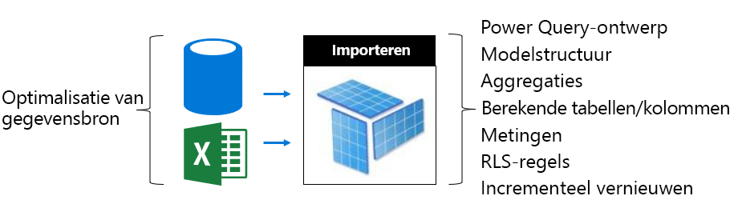

Op de gegevens bron-laag:

- Relationele gegevens bronnen kunnen worden geoptimaliseerd om ervoor te zorgen dat de snelste mogelijke vernieuwing door het vooraf integreren van gegevens, het Toep assen van toepasselijke indexen, het definiëren van tabel partities die afstemmen op incrementele vernieuwings perioden en materialiseren berekeningen (in plaats van berekende model tabellen en kolommen) of een berekenings logica toevoegen aan weer gaven
- Niet-relationele gegevens bronnen kunnen vooraf worden geïntegreerd met relationele winkels
- Zorg ervoor dat er voldoende resources voor gateways beschikbaar zijn, bij voorkeur op toegewezen computers, met voldoende netwerkbandbreedte en dicht bij de gegevensbronnen

In de modellaag:

- Door een Power Query op queryontwerpen uit te voeren, kunt u complexe transformaties minimaliseren of verwijderen, met name transformaties waarbij verschillende gegevensbronnen worden samengevoegd (voor datawarehouses wordt dit tijdens de ETL-fase (extraheren, transformeren, laden) bereikt). Om ervoor te zorgen dat de juiste privacyniveaus voor de gegevens bron zijn ingesteld, kan dit voor komen dat Power BI de volledige resultaten te laden om een gecombineerd resultaat te verkrijgen over query's.
- Welke gegevens worden geladen, wordt door de modelstructuur bepaald. Dit heeft direct invloed op de grootte van het model. Deze structuur kan worden ontworpen om het laden van onnodige gegevens te voorkomen door kolommen te verwijderen, rijen te verwijderen (met name historische gegevens) of samengevatte gegevens te laden (ten koste van het laden van gedetailleerde gegevens). U kunt de grootte aanzienlijk verminderen door kolommen met een hoge kardinaliteit (zoals tekstkolommen) te verwijderen die niet erg efficiënt kunnen worden opgeslagen of gecomprimeerd.
- De prestaties van modelquery's kunnen worden verbeterd door eendirectionele relaties te configureren, tenzij er een dwingende reden is om bidirectionele filters toe te staan. Overweeg ook de functie Cross filter te gebruiken in plaats van bidirectionele filters.
- Met aggregatietabellen kunt u snel reacties van query's krijgen door vooraf samengevatte gegevens te laden. Hierdoor neemt echter wel de modelgrootte toe en duurt het langer om gegevens te vernieuwen. Over het algemeen moeten aggregatietabellen voor heel grote modellen of voor samengestelde modelontwerpen worden gereserveerd.
- Door berekende tabellen en kolommen neemt de modelgrootte toe en duurt het langer om gegevens te vernieuwen. Over het algemeen kunt u een kleinere opslag grootte en een snellere vernieuwings tijd bereiken wanneer de gegevens worden gerealiseerd of berekend in de gegevens bron. Als dit niet mogelijk is, kunt u Power Query gebruiken voor aangepaste kolommen voor betere compressie van de opslag.
- Mogelijk bestaat er een kans om DAX-expressies af te stemmen voor metingen en RLS-regels, mogelijk door logica te herschrijven om dure formules te vermijden
- Door Incrementeel vernieuwen kunt u de vernieuwingstijd aanzienlijk verminderen en geheugen en CPU besparen. Incrementeel vernieuwen kan ook worden geconfigureerd om historische gegevens te verwijderen, zodat het model niet te groot wordt.
- Een model kan opnieuw worden ontworpen als twee modellen als er verschillende en conflicterende querypatronen bestaan. Sommige rapporten bevatten bijvoorbeeld aggregaties op hoog niveau met alle geschiedenis en kunnen een latentie van 24 uur weerstaan. In andere rapporten draait het om de gegevens van vandaag; hiervoor is nauwkeurige toegang tot afzonderlijke transacties vereist. In plaats van één model te ontwerpen voor alle rapporten, maakt u twee modellen die voor elke vereiste zijn geoptimaliseerd.

Bekijk de optimalisatiemogelijkheden voor een DirectQuery-model. Omdat het model query aanvragen naar de onderliggende gegevens bron verzendt, is de optimalisatie van gegevens bronnen van cruciaal belang voor het afleveren van responsieve model query's.

 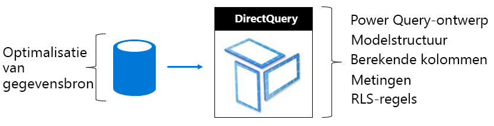

Op de gegevens bron-laag:

- De gegevens bron kan worden geoptimaliseerd om ervoor te zorgen dat de snelste mogelijke query wordt uitgevoerd door vooraf geintegreerde gegevens (die niet mogelijk zijn op de model laag), geschikte indexen toe te passen, tabel partities te definiëren, materialiseren samenvattings gegevens (met geïndexeerde weer gaven) en het minimaliseren van de berekenings hoeveelheid. De beste ervaring wordt bereikt wanneer passthrough-query's alleen kunnen worden gefilterd en Inner joins tussen geïndexeerde tabellen of weer gaven moeten worden uitgevoerd.
- Zorg ervoor dat gateways voldoende bronnen hebben, bij voor keur op toegewezen computers, met voldoende netwerk bandbreedte en dicht bij de gegevens bron

In de modellaag:

- Voor Power Query-query ontwerpen moet bij voor keur geen trans formaties worden toegepast. anders wordt geprobeerd trans formaties naar een absoluut minimum te beperken
- De prestaties van modelquery's kunnen worden verbeterd door eendirectionele relaties te configureren, tenzij er een dwingende reden is om bidirectionele filters toe te staan. Model relaties moeten ook worden geconfigureerd om te zorgen dat referentiële integriteit wordt afgedwongen (als dit het geval is) en resulteert in gegevens bron query's met behulp van efficiëntere Inner joins (in plaats van outer joins).
- Vermijd het maken van Power Query query aangepaste kolommen of model berekende kolom-realiseren deze in de gegevens bron, indien mogelijk
- Mogelijk bestaat er een kans om DAX-expressies af te stemmen voor metingen en RLS-regels, mogelijk door logica te herschrijven om dure formules te vermijden

Bekijk de optimalisatiemogelijkheden voor een samengesteld model. U weet dat met een samengesteld model een combinatie van geïmporteerde tabellen en DirectQuery-tabellen mogelijk is.

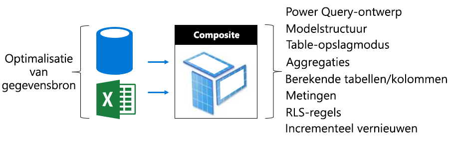

- Over het algemeen zijn de optimalisatie onderwerpen voor import-en DirectQuery-modellen van toepassing op samengestelde model tabellen die gebruikmaken van deze opslag modi.
- Maak een uitgebalanceerd ontwerp door tabellen van het type Dimensie (die bedrijfsentiteiten vertegenwoordigen) als dubbele opslagmodus te configureren en tabellen van het type Feit (vaak grote tabellen, die operationele feiten vertegenwoordigen) als de DirectQuery-opslagmodus te configureren. De modus voor dubbele opslag betekent zowel import-als DirectQuery-opslag modus, en Hiermee kan de Power BI-service de meest efficiënte opslag methode bepalen die moet worden gebruikt bij het genereren van een systeem eigen query voor passthrough.
- Zorg ervoor dat er voldoende resources voor gateways beschikbaar zijn, bij voorkeur op toegewezen computers, met voldoende netwerkbandbreedte en dicht bij de gegevensbronnen
- Met aggregatietabellen die als de importeeropslagmodus zijn geconfigureerd, kunnen de prestaties van query's aanzienlijk worden verbeterd wanneer ze worden gebruikt om tabellen van het type Feit voor de DirectQuery-opslagmodus samen te vatten. In dit geval wordt het model groter en duurt vernieuwen langer door de aggregatietabellen; dit is vaak een acceptabele balans voor snellere query's.

#### Extern gehoste modellen optimaliseren

Veel optimalisatie mogelijkheden die worden besproken in het onderwerp [optimalisatie van Power bi gehoste modellen](#optimizing-power-bi-hosted-models) zijn ook van toepassing op modellen die zijn ontwikkeld met Azure Analysis Services en SQL Server Analysis Services. De uitzondering geldt voor bepaalde functies die momenteel niet worden ondersteund, zoals samengestelde modellen en aggregatietabellen.

Wat extern gehoste gegevenssets betreft, moet ook rekening worden gehouden met de databasehosting met betrekking tot de Power BI-service. Voor Azure Analysis Services betekent dit dat u de Azure-resource in dezelfde regio moet maken als de Power BI-tenant (thuisregio). Voor SQL Server Analysis Services, voor IaaS, betekent dit dat u de virtuele machine in dezelfde regio moet hosten. Voor on-premises betekent dit dat u voor een efficiënte gatewayinstallatie moet zorgen.

Het is wellicht ook interessant om te weten dat modellen voor Azure Analysis Services-databases en SQL Server Analysis Services-databases met tabbladen volledig in het geheugen moeten worden geladen en dat ze daar te allen tijde blijven om het uitvoeren van query's te ondersteunen. Net zoals bij de Power BI-service moet er voldoende geheugen beschikbaar zijn om gegevens te kunnen vernieuwen indien het model online moet blijven tijdens het vernieuwen. In tegenstelling tot de Power BI-service is er geen concept waarbij modellen automatisch op basis van gebruik vanwege veroudering uit het geheugen worden gehaald of daarin worden geplaatst. Power BI Premium biedt dus een efficiëntere methode om modelquery's te maximaliseren met minder geheugengebruik.

### Capaciteits planning

De grootte van een Premium-capaciteit bepaalt hoeveel geheugen en processorresources hiervoor beschikbaar zijn en welke beperkingen voor de capaciteit gelden. Ook is het handig om over het aantal Premium-capaciteiten na te denken, omdat u workloads van elkaar kunt isoleren door meerdere Premium-capaciteiten te maken. Houd er rekening mee dat voor elk capaciteitsknooppunt 100 TB opslagruimte beschikbaar is; dit is waarschijnlijk meer dan genoeg voor elke workload.

Het kan een enorme uitdaging zijn om de grootte van en het aantal Premium-capaciteiten te bepalen, met name voor de initiële capaciteiten die u maakt. Wanneer u de grootte van een capaciteit gaat bepalen, moet u eerst weten wat de gemiddelde workload is die bij dagelijks gebruik kan worden verwacht. Het is belang rijk om te begrijpen dat niet alle werk belastingen gelijk zijn. Een voorbeeld: stel dat aan het ene uiteinde van een spectrum 100 gelijktijdige gebruikers zich toegang verschaffen tot één rapportpagina met één eenvoudig te maken visual. Tegelijkertijd proberen 100 gelijktijdige gebruikers aan het andere uiteinde van het spectrum toegang te krijgen tot 100 verschillende rapporten, elk met 100 visuals op de rapportpagina. Dit vergt een totaal andere vraag naar capaciteitsresources.

Capaciteitsbeheerders moeten daarom rekening houden met vele specifieke factoren voor uw omgeving, inhoud en verwachte gebruik. Het uiteindelijke doel is het gebruik van de capaciteit te maximaliseren en tegelijkertijd consistente querytijden, acceptabele wachttijden en verwijderingsnelheden te realiseren. Factoren die u kunt overwegen zijn bijvoorbeeld:

- **Model grootte en gegevens kenmerken** : import modellen moeten volledig in het geheugen zijn geladen om query's toe te staan of te vernieuwen. Voor LC/DQ-gegevenssets kan veel processortijd en mogelijk veel geheugen zijn vereist om complexe metingen of RLS-regels te evalueren. Voor het geheugen, de processorgrootte en de LC/DQ-querydoorvoer geldt een beperking volgens de capaciteitsgrootte.
- **Gelijktijdige actieve modellen** : de gelijktijdige query's van verschillende import modellen bieden de beste reactie snelheid en prestaties wanneer ze in het geheugen blijven. Er moet voldoende geheugen beschikbaar zijn om alle modellen waarop vaak query's worden uitgevoerd te hosten, met extra geheugen om gegevens te kunnen vernieuwen.
- **Import model vernieuwen** : het vernieuwings type (volledig of incrementeel), duur en complexiteit van Power query query's en berekende tabel/kolom logica kunnen invloed hebben op het geheugen en met name het processor gebruik. Gelijktijdige vernieuwingen worden beperkt door de capaciteitsgrootte (1,5 x de back-end v-cores, afgerond).
- **Gelijktijdige query's** : veel gelijktijdige query's kunnen leiden tot niet-reagerende rapporten wanneer processor-of LC/DQ-verbindingen de capaciteits limiet overschrijden. Dit geldt vooral voor rapportpagina's met veel visuals.
- **Gegevens stromen, gepagineerde rapporten en AI-functies** : de capaciteit kan worden geconfigureerd ter ondersteuning van gegevens stromen, gepagineerde rapporten en AI-functies, waarbij elk een configureerbaar maximum percentage van capaciteits geheugen vereist. Geheugen wordt dynamisch toegewezen aan gegevens stromen, maar het wordt statisch toegewezen aan gepagineerde rapporten en de AI-workload.

Naast deze factoren kunnen capaciteitsbeheerders ook meerdere capaciteiten maken. Met meerdere capaciteiten kunnen workloads worden geïsoleerd, en de capaciteiten kunnen zodanig worden geconfigureerd dat workloads met een hoge prioriteit gegarandeerd over resources kunnen beschikken. Er kunnen bijvoorbeeld twee capaciteiten worden gemaakt om bedrijfskritische workloads en SSBI-workloads (selfservice-BI) van elkaar te scheiden. De bedrijfskritische capaciteit kan worden gebruikt om grote bedrijfsmodellen te isoleren zodat hier gegarandeerd resources voor beschikbaar zijn, waarbij alleen aan de IT-afdeling schrijftoegang wordt verleend. De SSBI-capaciteit kan worden gebruikt om een toenemend aantal kleinere modellen te hosten, waarbij toegang wordt verleend aan bedrijfsanalisten. Voor de SSBI-capaciteit kunnen soms wachttijden voor query's of vernieuwingen worden ervaren die acceptabel zijn.

Na verloop van tijd kunnen capaciteitsbeheerders werkruimten over meerdere capaciteiten verdelen door inhoud tussen werkruimten of werkruimten tussen capaciteiten te verplaatsen en door de capaciteiten omhoog of omlaag te schalen. Over het algemeen is het mogelijk om grotere modellen te hosten die u omhoog kunt schalen en voor een hogere gelijktijdigheid.

U weet dat de tenant van v-cores wordt voorzien wanneer u een licentie aanschaft. De aankoop van een **P3**-abonnement kan worden gebruikt voor het maken van één of maximaal vier Premium-capaciteiten, zoals 1x P3, 2x P2 of 4x P1. Voordat u van een P2-capaciteit overstapt naar de grotere P3-capaciteit, kunt u overwegen om de v-cores op te splitsen en zo twee P1-capaciteiten te maken.

### Benaderingen testen

Zodra u de grootte van een capaciteit hebt bepaald, kunt u testen uitvoeren door een gecontroleerde omgeving te maken. Het is een praktische en rendabele optie om een Azure-capaciteit (A SKU's) te maken, waarbij u er rekening mee moet houden dat een P1-capaciteit dezelfde grootte heeft als een A4-capaciteit, waarbij de P2- en P3-capaciteiten dezelfde grootte hebben als respectievelijk de A5- en A6-capaciteiten. Azure-capaciteiten kunnen snel worden gemaakt en worden op uurbasis gefactureerd. Ze kunnen dus eenvoudig worden verwijderd zodra de testen zijn voltooid. Hiermee voorkomt u dat de kosten doorlopen.

De inhoud van de test kan worden toegevoegd aan de werkruimte die u op de Azure-capaciteit hebt gemaakt. Vervolgens kan één gebruiker rapporten uitvoeren om een realistische en representatieve workload met query's te genereren. Als er importeermodellen zijn, moet u ook elk model vernieuwen. Vervolgens kunt u gebruikmaken van controlehulpprogramma's om alle metrische gegevens te controleren, zodat u begrijpt hoe de resources worden gebruikt.

Het is belang rijk dat de tests worden herhaald: tests moeten meermaals worden uitgevoerd en moeten telkens ongeveer hetzelfde resultaat leveren. Het gemiddelde van deze resultaten kan worden gebruikt om een workload te extrapoleren en in te schatten op basis van echte productievoorwaarden.

Als u al beschikt over een capaciteit en de rapporten waarop u een laadtest wilt uitvoeren, gebruikt u het [PowerShell-hulpprogramma voor het genereren van een laadtest](https://aka.ms/PowerBILoadTestingTool) om snel een laadtest te genereren. Met dit hulpprogramma kunt u inschatten hoeveel exemplaren van elk rapport binnen een uur door uw capaciteit kunnen worden uitgevoerd. Gebruik het hulpprogramma om te evalueren in hoeverre u afzonderlijke rapporten kunt weergeven met uw capaciteit of verschillende rapporten tegelijkertijd kunt weergeven. Zie de video [micro soft power BI: Premium capacity](https://www.youtube.com/watch?time_continue=1860&v=C6vk6wk9dcw)(Engelstalig) voor meer informatie.

Als u een complexere test wilt genereren, kunt u een toepassing voor laadtesten ontwikkelen waarbij een realistische workload wordt gesimuleerd. Zie de webinar [Load Testing Power BI Applications with Visual Studio Load Test](https://www.youtube.com/watch?v=UFbCh5TaR4w) (Laadtesten uitvoeren op Power BI-toepassingen met de Visual Studio-laadtest) voor meer informatie.

## Real-World Scenario's verkennen

In deze sectie worden verschillende praktijk scenario's geïntroduceerd om veelvoorkomende problemen of uitdagingen te beschrijven, hoe u ze kunt identificeren en hoe u deze kunt oplossen:

- [Gegevens sets up-to-date houden](#keeping-datasets-up-to-date)
- [Identificeren van gegevens sets die langzaam reageren](#identifying-slow-responding-datasets)
- [Oorzaken identificeren voor gegevens sets die sporadisch langzaam reageren](#identifying-causes-for-sporadically-slow-responding-datasets)
- [Bepalen of er voldoende geheugen is](#determining-whether-there-is-enough-memory)
- [Bepalen of er voldoende CPU is](#determining-whether-there-is-enough-cpu)

De stappen, samen met de voor beelden van grafieken en tabellen, zijn afkomstig uit de app (app) voor de **Power bi Premium capaciteits gegevens** waarmee een Power bi beheerder toegang heeft.

### Gegevens sets up-to-date houden

In dit scenario werd een onderzoek geactiveerd wanneer gebruikers hebben geklagen dat rapport gegevens soms oud of ' verouderd ' zijn.

In de app communiceert de beheerder met de **vernieuwde** Visual, waarbij gegevens sets worden gesorteerd op de statistieken voor de **maximum wacht tijd** in aflopende volg orde. Zo kunnen ze de gegevens sets met de langste wacht tijden weer geven, gegroepeerd op naam van de werk ruimte.

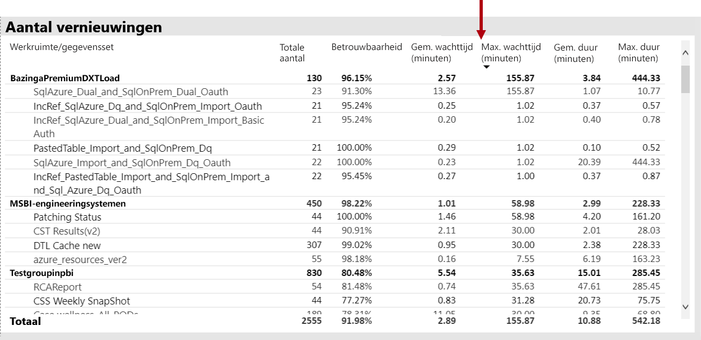

Daarnaast ziet u in de visuele **wacht tijden voor vernieuwen per uur** dat de vernieuwde wacht tijden voor de 4 p.m. elke dag even lang zijn.

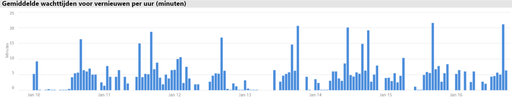

Er zijn verschillende mogelijke verklaringen voor deze resultaten:

- Er kunnen op hetzelfde moment te veel vernieuwings pogingen plaatsvinden, waardoor de limieten die worden opgelegd door het capaciteits knooppunt (zes gelijktijdige vernieuwingen op een P1 met standaard geheugen toewijzing) worden overschreden

- Gegevens sets die moeten worden vernieuwd, zijn mogelijk te groot om in het beschik bare geheugen te passen (hiervoor is mini maal twee geheugen vereist voor een volledige vernieuwing)
- Inefficiënte Power Query logica kan tijdens het vernieuwen van de gegevensset resulteren in een piek in het geheugen gebruik. Bij een bezette capaciteit kan dit af en toe de fysieke limiet bereiken, waardoor het vernieuwen mislukt en mogelijk invloed heeft op andere bewerkingen van de rapport weergave op de capaciteit.
- Vaak query gegevens sets die in het geheugen moeten blijven, kunnen invloed hebben op de mogelijkheid van andere gegevens sets die moeten worden vernieuwd, vanwege een beperkt beschikbaar geheugen

Om dit te helpen onderzoeken, kan de Power BI beheerder zoeken naar:

- Weinig beschikbaar geheugen op het moment van vernieuwen van gegevens, wanneer het beschik bare geheugen kleiner is dan 2x de grootte van de gegevensset die moet worden vernieuwd
- Gegevens sets die niet zijn vernieuwd en die niet in het geheugen zijn geladen vóór het vernieuwen, terwijl het interactieve verkeer tijdens zware vernieuwings tijden werd weer gegeven. Als u wilt zien welke gegevens sets in het geheugen zijn geladen, kan een Power BI beheerder het gebied gegevens sets van het tabblad **gegevens sets** in de app bekijken en kruislings filteren op een bepaald tijdstip door te klikken op een van de balken in het **per uur geladen aantal gegevensset**. Een lokale Prikker (weer gegeven in de onderstaande afbeelding) geeft een uur aan wanneer meerdere gegevens sets in het geheugen zijn geladen, waardoor het starten van geplande vernieuwingen kan vertragen
- Grotere gegevensset-verwijderingen tijdens het plannen van gegevens die zijn gepland om te starten, hetgeen duidt op een hoge hoeveelheid geheugen die is veroorzaakt door te veel verschillende interactieve rapporten vóór het moment van vernieuwen. De visualisatie voor het verwijderen van de **gegevensset en het geheugen gebruik** kan duidelijk duiden op pieken in verwijderingen.

In de volgende afbeelding ziet u een lokale Prikker in geladen gegevens sets, waarmee wordt aangegeven dat het vertraagd starten van vernieuwingen door interactieve query's wordt voorgesteld. Als u een tijds periode selecteert in de visuele **aantallen gegevensset aantal geladen** items, wordt de grootte van de **gegevensverzamelings** elementen kruislings gefilterd.

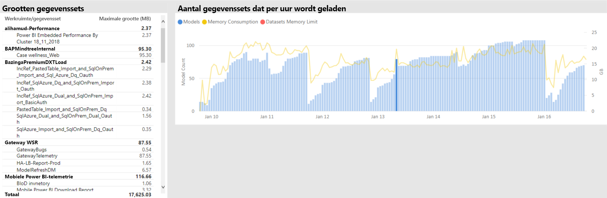

De Power BI-beheerder kan proberen het probleem op te lossen door stappen uit te voeren om ervoor te zorgen dat er voldoende geheugen beschikbaar is voor het vernieuwen van gegevens om te beginnen met:

- Contact opnemen met de eigenaar van de gegevensset en vragen om de planningen voor gegevens vernieuwing te spreiden
- Het verminderen van het laden van de gegevensset door onnodige Dash boards of dashboard tegels te verwijderen, met name die die beveiliging op rijniveau afdwingen
- Versnelde gegevens vernieuwt door Power Query logica te optimaliseren, berekende kolommen of tabellen te model leren, de grootte van de gegevensset te verlagen of grotere gegevens sets te configureren voor het uitvoeren van incrementele data vernieuwing

### Identificeren van gegevens sets die langzaam reageren

In dit scenario werd een onderzoek geactiveerd wanneer gebruikers hebben geklagen dat bepaalde rapporten veel tijd in beslag hadden om te openen, en op tijdstippen.

De Power BI-beheerder kan in de app de visuele **duur** van de query gebruiken om de slechtste gegevens sets te bepalen door gegevens sets te sorteren op aflopende **gemiddelde duur**. In dit visuele element worden ook de query aantallen voor de gegevensset weer gegeven, zodat u kunt zien hoe vaak de gegevens sets worden opgevraagd.

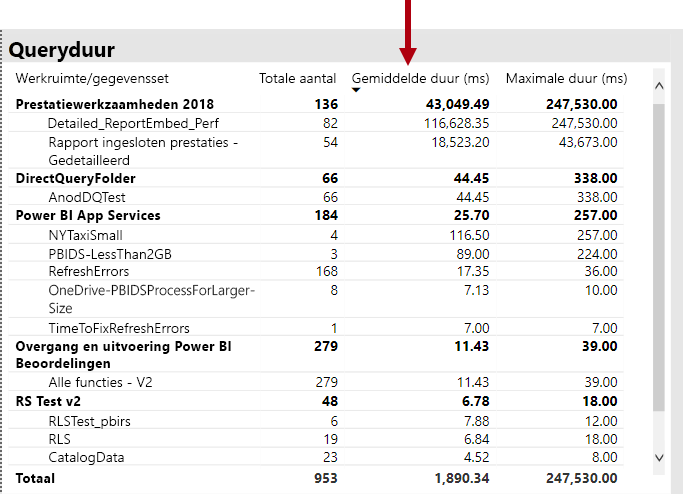

De beheerder van de Power BI kan verwijzen naar het visuele element **query duur distributie** , waarin een algemene verdeling van de Bucket query prestaties wordt weer gegeven (< = 30ms, 0-100 MS, enzovoort) voor de gefilterde periode. Over het algemeen worden query's die een seconde of minder duren, beschouwd als reactie door de meeste gebruikers. query's die langer duren, maken een beeld van slechte prestaties.

Met de **taak duur** van een query naar een periode van het ene uur kan de Power bi beheerder enkele uurtransacties identificeren wanneer de capaciteits prestaties als slecht zijn waargenomen. Hoe groter de staaf segmenten die de duur van query's voor de ene seconde vertegenwoordigen, hoe groter het risico is dat gebruikers slechte prestaties zullen oplopen.

Het visuele element is interactief en wanneer een segment van de balk is geselecteerd, wordt de overeenkomende **query duur** tabel Visual op de rapport pagina gefilterd om de gegevens sets weer te geven die het vertegenwoordigt. Met deze kruislings filteren kan de Power BI beheerder gemakkelijk bepalen welke gegevens sets langzaam reageren.

In de volgende afbeelding ziet u een visueel gefilterde **taak duur**van een query per uur, die gericht is op de slechtste gegevens sets die worden uitgevoerd in een interval van één uur. 

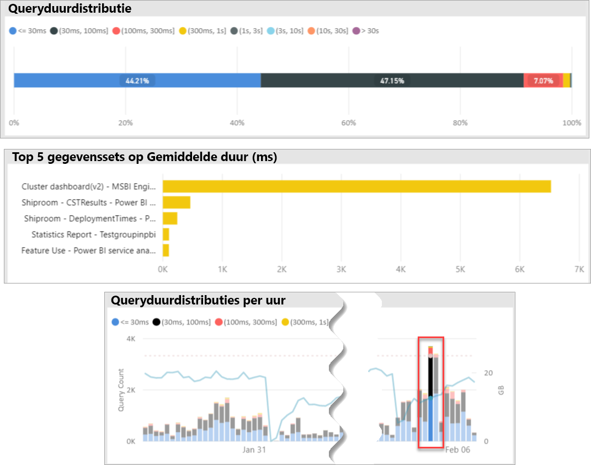

Zodra de slecht presterende gegevensset in een specifieke time span van 1 uur wordt geïdentificeerd, kan de Power BI beheerder onderzoeken of slechte prestaties worden veroorzaakt door overbelaste capaciteit of door een slecht ontworpen gegevensset of rapport. Hiervoor kunnen ze verwijzen naar de **query wacht tijden van query's** en de gegevens sets sorteren op aflopende gemiddelde wacht tijd van de query. Als een groot percentage van query's wacht, is een grote vraag naar de gegevensset waarschijnlijk de oorzaak van de veel query's. Als de gemiddelde wacht tijd voor query's aanzienlijk is (> 100 MS), is het mogelijk dat u de gegevensset en het rapport controleert om te zien of er optimalisaties kunnen worden uitgevoerd. Bijvoorbeeld: minder visuele elementen op gegeven rapport pagina's of een DAX-expressie optimalisatie.

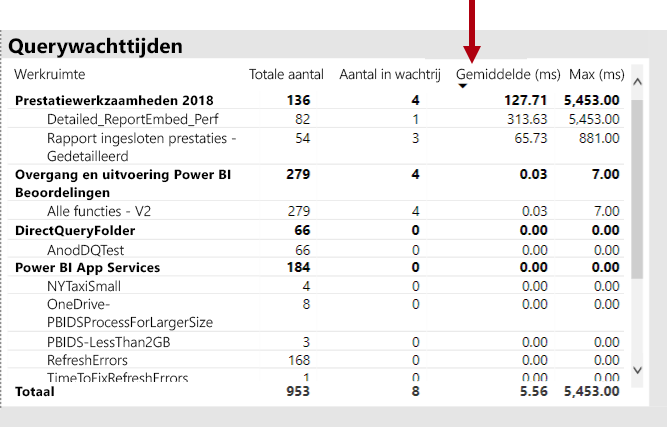

Er zijn verschillende mogelijke redenen voor het opruimen van query's in gegevens sets:

- Een suboptimaal model ontwerp, metings expressies of zelfs rapport ontwerp: alle omstandigheden die kunnen bijdragen aan langlopende query's die hoge CPU-niveaus verbruiken. Hierdoor worden nieuwe query's gewacht totdat de CPU-threads beschikbaar zijn en kan er een verwerkings-effect worden gemaakt (denk eraan dat het verkeer is vastgelopen). dit wordt doorgaans gezien tijdens de piek uren van het kantoor. De pagina **wacht op query** wordt de hoofd resource om te bepalen of gegevens sets een hoog gemiddelde wacht tijden voor query's hebben.
- Een groot aantal gelijktijdige capaciteits gebruikers (honderden duizend tallen) die hetzelfde rapport of dezelfde gegevensset gebruiken. Zelfs goed ontworpen gegevens sets kunnen buiten een gelijktijdigheids drempel worden uitgevoerd. Dit wordt doorgaans aangegeven door één gegevensset die een aanzienlijk hogere waarde voor query aantallen weergeeft dan andere gegevens sets tonen (d.w.z. 300 query's voor één gegevensset vergeleken met < 30K query's voor alle andere gegevens sets). Op een bepaald moment wordt de query gewacht op een sprei ding van deze gegevensset. dit wordt weer gegeven in de visuele **query duur** .
- Veel ongelijksoortige gegevens sets worden gelijktijdig geraadpleegd, waardoor overbelasting als gegevens sets regel matig in en uit het geheugen worden gebruikt. Dit resulteert in gebruikers die trage prestaties ondervinden wanneer de gegevensset in het geheugen wordt geladen. Om dit te bevestigen, kan de beheerder van de Power BI verwijzen naar de visualisatie voor het verwijderen van de gegevensset en het visuele element voor **geheugen gebruik** . Dit kan erop wijzen dat een groot aantal gegevens sets dat in het geheugen is geladen herhaaldelijk wordt verwijderd.

### Oorzaken identificeren voor gegevens sets die sporadisch langzaam reageren

In dit scenario werd een onderzoek geactiveerd wanneer gebruikers worden beschreven dat visuele elementen in het rapport soms langzaam reageren op reacties of niet reageren, maar op andere momenten dat ze op een andere manier reageren.

In de app is de sectie **duur van query's** gebruikt om de culprit-gegevensset op de volgende manier te vinden:

- In de **query duur** van de door de beheerder gefilterde gegevensset op gegevensset (beginnend bij de bovenste gegevens sets wordt een query uitgevoerd) en de kruislings gefilterde balken in de Visual- **verdeling van Query's** voor het uur worden onderzocht.
- Als er in één enkele uur een staaf met significante wijzigingen in de verhouding tussen alle query duur groepen versus andere één uur wordt weer gegeven voor die gegevensset (dat wil zeggen de verhouding tussen de kleuren drastisch te wijzigen), betekent dit dat deze gegevensset een sporadische wijziging in nemen.
- De One-Hour-balken met een onregelmatige deel van slechtere query's, duiden een time span aan waar deze gegevensset werd beïnvloed door een onrustige buur effect, veroorzaakt door andere data sets-activiteiten.

In de onderstaande afbeelding ziet u één uur op 30 januari, waarbij een aanzienlijke setback in de prestaties van een gegevensset is opgetreden, aangegeven door de grootte van de Bucket ' (3, 10] '. Als u op de ene uur-staaf klikt, worden alle gegevens sets die tijdens die tijd in het geheugen zijn geladen, halen de culprit-gegevens sets die het effect van de ruis op de buur veroorzaken.

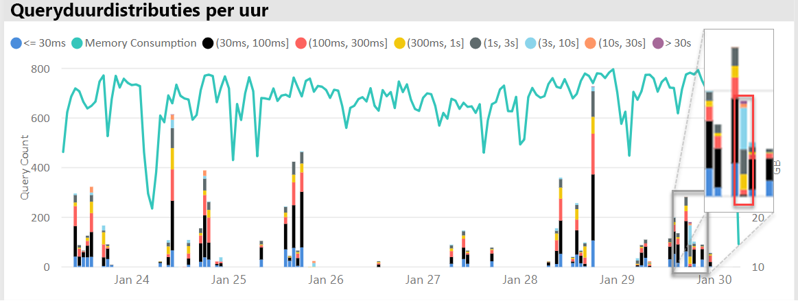

Zodra een problematische time span is geïdentificeerd (bijvoorbeeld in 30 januari in de bovenstaande afbeelding), kan de Power BI beheerder alle gegevensset-filters verwijderen en vervolgens alleen filteren op die tijds duur om te bepalen welke gegevens sets actief werden tijdens deze periode. De culprit-gegevensset voor het Neighbor-effect van de ruis is doorgaans de bovenste gevraagde gegevensset of de DataSet met de langste gemiddelde query duur.

Een oplossing voor dit probleem is het distribueren van de culprit-gegevens sets over verschillende werk ruimten op verschillende Premium-capaciteiten of op basis van gedeelde capaciteit als de grootte van de gegevensset, de vereisten voor het verbruik en gegevens vernieuwings patronen worden ondersteund.

Het omgekeerde zou ook waar kunnen zijn. De Power BI-beheerder kan tijdstippen herkennen wanneer de prestaties van een DataSet-query drastisch verbeteren en vervolgens zoeken naar wat er verdwenen is. Als er op dat moment bepaalde informatie ontbreekt, kan dit ertoe leiden dat de oorzaak van het probleem kan wijzen.

### Bepalen of er voldoende geheugen is

Om te bepalen of er voldoende geheugen beschikbaar is voor de capaciteit om de werk belastingen te kunnen volt ooien, kan de Power BI beheerder naar het visuele percentage van het **verbruikte geheugen** in het tabblad **gegevens sets** van de app. **Alle** (totale) geheugen is het geheugen dat wordt gebruikt door gegevens sets die in het geheugen zijn geladen, ongeacht of ze actief worden opgevraagd of verwerkt. **Actief** geheugen vertegenwoordigt het geheugen dat wordt gebruikt door gegevens sets die actief worden verwerkt.

In een gezonde capaciteit ziet de Visual er als volgt uit, waarbij een hiaat tussen alle (totaal) en het actieve geheugen wordt weer gegeven:

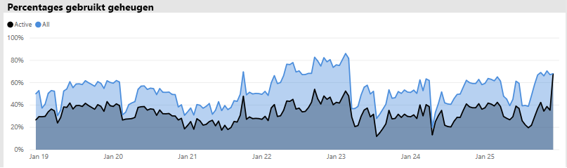

In het geval van een geheugen druk wordt in dezelfde Visual het actieve geheugen en het totale geheugen convergentie weer gegeven, wat betekent dat het onmogelijk is om extra gegevens sets te laden in het geheugen op dat moment. In dit geval kan de Power BI-beheerder klikken op **capaciteit opnieuw opstarten** (in **Geavanceerde opties** van het gebied capaciteits instellingen van de beheer Portal). Het opnieuw starten van de capaciteit resulteert in alle gegevens sets die uit het geheugen worden leeg gemaakt en waardoor ze in het geheugen kunnen worden geladen als vereist (door query's of gegevens vernieuwing).

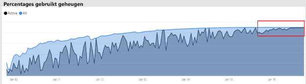

### Bepalen of er voldoende CPU is

Over het algemeen moet het gemiddelde CPU-gebruik van de capaciteit onder 80% blijven. Als deze waarde wordt overschreden, betekent dit dat de capaciteit een CPU-verzadiging nadert.

Effecten van CPU-verzadiging worden uitgedrukt door bewerkingen die langer duren dan de capaciteit die nodig is voor het verwerken van alle bewerkingen door een groot aantal CPU-context switches uit te voeren. In een Premium-capaciteit met een groot aantal gelijktijdige query's wordt dit aangegeven door hoge wacht tijden voor query's. Een hoge wacht tijd voor query's is een trage reactie snelheid dan normaal. De beheerder van de Power BI kan gemakkelijk identificeren wanneer de CPU verzadigd is door het aantal gestarte **wacht tijden** voor de query te bekijken. Bij periodieke pieken van de wacht tijd voor query's wordt een mogelijke CPU-verzadiging aangegeven.

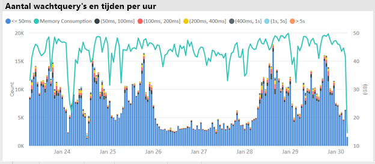

Een vergelijkbaar patroon kan soms worden gedetecteerd in achtergrond bewerkingen als ze bijdragen aan de CPU-verzadiging. Een Power BI beheerder kan zoeken naar een periodieke piek in vernieuwings tijden voor een specifieke gegevensset. Dit kan duiden op CPU-verzadiging op het moment (waarschijnlijk door andere actieve gegevensset vernieuwingen en/of interactieve query's). In dit geval is het mogelijk dat de **systeem** weergave in de app niet noodzakelijkerwijs de CPU ten 100% bevindt. In de **systeem** weergave worden gemiddelde uren weer gegeven, maar de CPU kan worden verzadigd gedurende enkele minuten van zware bewerkingen, die als pieken in wacht tijden worden weer gegeven.

Er zijn meer nuances om het effect van de CPU-verzadiging te bekijken. Hoewel het aantal query's dat moet wachten belang rijk is, gebeurt er altijd een wacht tijd in de query, zonder dat er sprake is van een afname van de prestaties. Sommige gegevens sets (met een lengthier gemiddelde query tijd, die de complexiteit of grootte aangeeft) zijn gevoelig voor de effecten van CPU-verzadiging dan andere. Om deze gegevens sets gemakkelijk te kunnen identificeren, kan de Power BI-beheerder zoeken naar wijzigingen in de kleuren samenstelling van de balken in het Visual **uur wacht tijd verdeling** . Na het herkennen van een uitschieter-balk, kunnen ze de gegevens sets zoeken die tijdens die tijd een query hebben gewacht en ook de gemiddelde wacht tijd van de query vergelijken met de gemiddelde duur van de query. Als deze twee meet waarden dezelfde grootte hebben en de query workload voor de gegevensset niet-trivial is, is het waarschijnlijk dat de gegevensset wordt beïnvloed door onvoldoende CPU.

Dit effect kan bijzonder duidelijk zijn wanneer een gegevensset wordt gebruikt in korte bursts van hoge frequentie query's door meerdere gebruikers (d.w.z. in een trainings sessie), wat resulteert in een CPU-verzadiging tijdens elke burst. In dit geval zijn er belang rijke wacht tijden voor query's op deze gegevensset en kunnen ze invloed hebben op andere gegevens sets in de capaciteit (ruis-effect).

In sommige gevallen kunnen Power BI beheerders aanvragen dat dataset-eigen aren een minder vluchtige query werk belasting maken door een dash board te maken (die regel matig query's uitvoeren bij het vernieuwen van de gegevensset voor tegels in de cache) in plaats van een rapport. Dit kan helpen bij het voor komen van pieken wanneer het dash board wordt geladen. Deze oplossing is mogelijk niet altijd mogelijk voor bepaalde bedrijfs vereisten, maar dit kan een efficiënte manier zijn om CPU-verzadiging te voor komen, zonder dat u wijzigingen in de gegevensset hoeft aan te brengen.

## Conclusie

Power BI Premium biedt consistente prestaties, ondersteuning voor grote gegevens volumes en de flexibiliteit van een Unified self-service-en Enter prise BI-platform voor iedereen in uw organisatie. Dit niveau 300 technisch White Paper is speciaal geschreven voor Power BI beheerders en auteurs van inhoud en uitgevers. Het is erop gericht om ze inzicht te geven in de mogelijkheden van Power BI Premium en om uit te leggen hoe schaal bare oplossingen moeten worden ontworpen, geïmplementeerd, gecontroleerd en opgelost.

Voor het implementeren en beheren van Power BI Premium capaciteiten moeten beheerders en model ontwikkelaars een zeer goed beeld hebben van de functie van capaciteit, hoe ze kunnen worden beheerd en bewaakt, en hoe modellen kunnen worden geoptimaliseerd, om op de juiste wijze te reageren op prestatie problemen en knel punten moeten zich voordoen.

## Notities beëindigen

\[1\] dit technisch document is betrokken bij Power BI Premium dat alleen wordt ondersteund door de Power BI-Cloud service, en dat Power BI Report Server niet binnen het bereik valt, behalve de status dat de licentie die vereist is voor de installatie van Power BI Report Server, is opgenomen in enkele Power BI Premium Sku's.

\[2\] Power BI als een Cloud service die wordt gebruikt voor het insluiten van inhoud namens toepassings gebruikers is PaaS (platform-as-a-Service). Dit type insluiting kan worden bereikt met verschillende twee producten, een van Power BI Premium.

\[3\] push-, streaming-en hybride gegevens sets worden niet opgeslagen in Premium-capaciteiten en zijn daarom geen overweging bij het implementeren, beheren en controleren van Premium-capaciteiten.

\[4\] Excel-werkmappen als Power BI inhouds type worden niet opgeslagen in Premium-capaciteiten en zijn daarom geen overweging bij het implementeren, beheren of bewaken van Premium-capaciteiten.

\[5\] visuele elementen kunnen worden geconfigureerd om de interacties van slicer te negeren. Raadpleeg de [visualisatie interacties in een Power bi-rapport](service-reports-visual-interactions.md) document voor meer informatie.

\[6\] het verschil in grootte kan worden bepaald door de Power BI Desktop bestands grootte te vergelijken met het taak beheer geheugen dat voor het bestand wordt gebruikt.

\[7\] ondersteuning voor micro soft-gegevens bronnen zijn SQL Server, Azure data Bricks, Azure HDInsight Spark (bèta), Azure SQL Database en Azure SQL Data Warehouse. Raadpleeg voor meer informatie over aanvullende bronnen de [gegevens bronnen die worden ondersteund door direct query in Power bi](desktop-directquery-data-sources.md) document.

\[8\] Power BI Premium ondersteunt het uploaden van een Power BI Desktop-bestand (. pbix) tot Maxi maal 10 GB. Zodra het uploaden is gelukt, kan een gegevensset tot 12 GB groter worden als gevolg van het vernieuwen. De maximale upload grootte is afhankelijk van de SKU. Raadpleeg het document [Power bi Premium ondersteuning voor grote gegevens sets](service-premium-large-datasets.md) voor meer informatie.

\[9\] Sku's met minder dan vier v-cores worden niet uitgevoerd op een speciale infra structuur. Dit omvat de EM1-, EM2-, a1-en a2-Sku's.

\[10\] hoewel dit zelden voor komt, kunnen modellen uit het geheugen worden verwijderd als gevolg van service bewerkingen.

\[11\] deze tijds instellingen kunnen op elk gewenst moment worden gewijzigd.

\[12\] wordt dit aangeduid als multi-geo, momenteel als preview-versie. De gedachte achter multigeografische implementatie is doorgaans zakelijke compliance of overheidsnaleving in plaats van prestaties en schaal. Voor het laden van rapporten en dashboards zijn nog steeds verzoeken bij de thuisregio van de metagegevens nodig. Raadpleeg het document [multi-geo-ondersteuning voor Power bi Premium (preview)](service-admin-premium-multi-geo.md) voor meer informatie.

\[13\] is het mogelijk dat gebruikers prestatie problemen kunnen veroorzaken door de Power BI-service met taken te overbelasten, over complexe query's te schrijven, kring verwijzingen te maken, enzovoort.

\[14\] de optie om de werk ruimten van de hele organisatie toe te wijzen, wordt niet aanbevolen en een meer gerichte aanpak verdient de voor keur. Over het algemeen is het niet best practice om persoonlijke werk ruimten te gebruiken voor productie-inhoud.

\[15\] is het mogelijk om een SKU in de app of in de Azure Portal te bewaken, maar niet in de Power BI beheer Portal. Als u een SKU wilt bewaken, mislukt het vernieuwen van het rapport als de app niet is toegevoegd aan de rol van lezer van de resource. Raadpleeg het document [Monitor Power bi Premium en Power bi embedded capaciteit](service-admin-premium-monitor-capacity.md) voor meer informatie.

\[16\] vernieuwingen kunnen wachten wanneer er onvoldoende CPU of geheugen is om te starten.

\[17\] de grootte van de gegevensset in het geheugen groter mag zijn dan de grootte op schijf, Maxi maal 20%.

\[18\] gemiddeld geheugen gebruik (GB) en het hoogste geheugen verbruik (GB)

\[19\] gegevensset verwijderen

\[20\] gegevensset-Query's, gemiddelde query duur van gegevensset (MS), aantal wacht tijden voor gegevensset en gemiddelde wacht tijd van de gegevensset (MS)

\[21\] aantal intensief gebruik van CPU en CPU-tijd van het hoogste gebruik (afgelopen zeven dagen)

\[22\] DQ/hoge gebruiks telling en DQ/LC-tijd van het hoogste gebruik (afgelopen zeven dagen)
